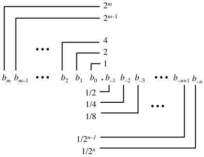
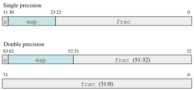
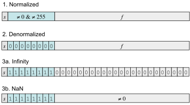

# 1. 信息存储

# 2. 整数表示

# 3. 整数运算

# 4. 浮点数

## 二进制小数

$$
b \coloneqq (b_{m}\,b_{m-1}\cdots b_{1}\,b_{0}\,.\,b_{-1}\,b_{-2}\cdots b_{1-n}\,b_{-n})_2
= \sum_{k=-n}^m 2^k \times b_k
$$

## IEEE 754

$$
V \coloneqq \left(s\,\underbrace{e_{k-1}\cdots e_{1}\,e_{0}}_{e}\,\overbrace{f_{-1}\,f_{-2}\cdots f_{-n}}^{f}\right)_2
= (-1)^s \times 2^{E(e)} \times M(f)
$$

其中
- $e$ 为 $k$ 位二进制整数，其值为 $\sum_{i=0}^{k-1}2^i\times e_i$
- $f$ 为 $n$ 位[二进制小数](#二进制小数)，其值为 $\sum_{i=1}^n 2^{-i}\times f_{-i}$
- 单精度 $k+n=8+23$
- 双精度 $k+n=11+52$

记 $b \coloneqq 2^{k-1} - 1$，则除特殊值外
- $E(e) \coloneqq (e \mathbin{?} e : 1) - b$
- $M(f) \coloneqq (e \mathbin{?} 1 : 0) - b$

根据 $e$ 的取值，可分为三种情形：

|            |        退化情形         |       常规情形       | 特殊值 |
| :--------: | :---------------------: | :------------------: | :------: |
| $(e_i)_{i=0}^{k-1}$ | 全为 $0$ | 既有 $0$ 又有 $1$ | 全为 $1$ |
|    $e$     |           $0$           | $\sum_{i=0}^{k-1}2^i e_i\in[1,2^k-2]$ | $\sum_{i=0}^{k-1}2^i=2^k-1$ |
| $E$ | $1-b$ | $e-b$ |  |
| $M$ | $0+f=\sum_{i=1}^n 2^{-i}f_{-i}$ | $1+f=1+\sum_{i=1}^n 2^{-i}f_{-i}$ |  |
|    $\vert V\vert$    |    $2^{1-b}\times(0+f)$    | $2^{e-b}\times(1+f)$ | $ f \mathbin{?} \text{NaN} : \infty$ |
| $\min$ | $0$ | $2^{1-b}$ |  |
| $\max$ | $2^{1-b}(1-2^{-n})$ | $2^b(2-2^{-n})$ |  |

