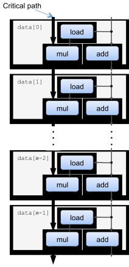
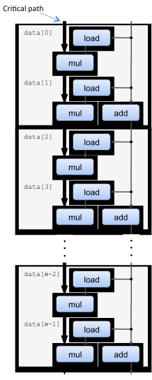
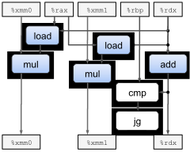
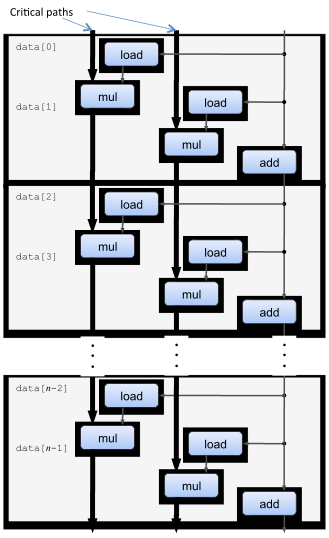
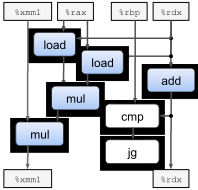
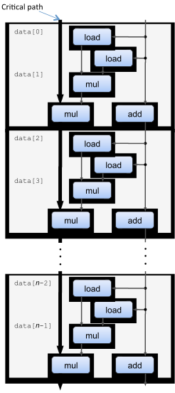

# 1. 编译器的优化能力及限制

```c
void twiddle1(long *xp, long *yp) {
  *xp += *yp;
  *xp += *yp;
}
void twiddle2(long *xp, long *yp) {
  *xp += 2 * *yp;
}
```

当 `xp == yp` 时（此时称它们互为**内存别名 (memory alias)**），这两个函数并不等价。
编译器无法判断程序意图，故不会将 `twiddle1` 优化为 `twiddle2`。

# 2. 表达程序性能

现代处理器的*主频*通常达到 GHz，其倒数被称为**时钟周期 (clock cycle)**。
后者是度量指令运行时间的基本单位。

**CPE (Cycles Per Element)** 比 **CPI (Cycles Per Iteration)** 更适合用来度量**循环 (loop)** 的性能。
这是因为[循环展开](#unroll)技术会在一次**迭代 (iteration)** 中安排多个计算**单元 (element)**。

# 3. 程序示例

```c
/* Create abstract data type for vector */
typedef double data_t;  /* `data_t` may also be `int`, `long`, `float` */
typedef struct {
  long len;
  data_t *data;
} vec_rec, *vec_ptr;
/* `IDENT` and `OP` may also be `1` and `*` respectively */
#define IDENT 0
#define OP +
```

测量结果表明：`data_t` 取作
- `int` 与 `long` 差别不大。
- `float` 与 `double` 差别不大。

最大程度保留数据抽象的原始版本：

```c
/* Implementation with maximum use of data abstraction */
void combine1(vec_ptr v, data_t *dest) {
  long i;
  *dest = IDENT;
  for (i = 0; i < vec_length(v); i++) {
    data_t val;
    get_vec_element(v, i, &val);
    *dest = *dest OP val;
  }
}
```

# 4. 移出重复操作

尽管 `vec_length(v)` 具有 $O(1)$ 复杂度，在循环条件中反复调用仍是浪费：

```c
/* Move call to vec_length out of loop */
void combine2(vec_ptr v, data_t *dest) {
  long i;
  long n = vec_length(v);  /* 缓存循环不变量 */
  *dest = IDENT;
  for (i = 0; i < n; i++) {
    data_t val;
    get_vec_element(v, i, &val);
    *dest = *dest OP val;
  }
}
```

像 `strlen(s)` 这样具有 $O(N)$ 复杂度的操作，更应缓存其结果于循环体外：

```c
/* Sample implementation of library function strlen */
size_t strlen(const char *s) {
  long length = 0;
  while (*s != ’\0’) {
    s++;
    length++;
  }
  return length;
}

/* Convert string to lowercase: slow */
void lower1(char *s) {
  long i;
  for (i = 0; i < strlen(s); i++)
    if (s[i] >= ’A’ && s[i] <= ’Z’)
      s[i] -= (’A’ - ’a’);
}
```

# 5. 减少函数调用

`combine2()` 的循环体中调用了 `get_vec_element(v, i, &val)`，它会检查 `i` 是否越界。
将数组的首地址*偷出*，可避开不必要的越界检查：

```c
data_t *get_vec_start(vec_ptr v) {
  return v->data;
}
/* Direct access to vector data */
void combine3(vec_ptr v, data_t *dest) {
  long i, n = vec_length(v);
  data_t *data = get_vec_start(v);  /* 偷出数组首地址 */
  *dest = IDENT;
  for (i = 0; i < n; i++) {
    *dest = *dest OP data[i];
  }
}
```

⚠️ 此优化并没有显著提升性能，因为循环体内还有其他低效操作。

# 6. 减少内存访问

将中间结果缓存于寄存器中，而不是反复读写内存，可显著提高性能：

```c
/* Accumulate result in local variable */
void combine4(vec_ptr v, data_t *dest) {
  long i, n = vec_length(v);
  data_t *data = get_vec_start(v);
  data_t result = IDENT;  /* 缓存于寄存器中 */
  for (i = 0; i < n; i++) {
    result = result OP data[i];
  }
  *dest = result;
}
```

# 7. 理解现代处理器

以 Intel 为代表的现代处理器能够同时执行多条指令，并且保证所得结果与顺序执行机器码的结果一致。
这种**乱序 (out-of-order)** 执行指令的加速机制被称为**指令级并行 (instruction-level parallelism)**。

## 7.1. 基本操作


**指令控制单元 (instruction control unit, ICU)** 从[指令缓存](./6_memory_hierarchy.md#i-cache)中读取将要被执行的指令（通常大大超前于当前指令），将其**解码 (decode)** 为若干**初等操作 (primitive operation)** 并交由**执行单元 (execution unit, EU)** 去执行。

遇到[条件跳转](./3_machine_level_programming.md#jump)指令时，ICU 会做出**分支预判 (branch prediction)**，即令 EU 在所预判的分支上提前执行一些指令。
若预判错误，则 EU 会丢弃所得结果，并在正确的分支上重新计算。

EU 由**功能单元 (functional unit, FU)** 和**数据缓存 (data cache)** 组成。
其中，一个 FU 可兼容多种功能，一种功能也可由多个 FU 完成。

ICU 中的**退休单元 (retirement unit)** 用于确保乱序执行指令的结果与顺序执行这些指令的结果一致。
只有当分支预判正确时，才会更新寄存器。

在 EU 中，一条（初等）操作的结果，可以直接转发给后续操作，而不需要读写寄存器。
该机制被称为**寄存器重命名 (register renaming)**。

## 7.2. 功能单元性能

性能指标：

|         名称          |               定义               | 符号  |
| :-------------------: | :------------------------------: | :---: |
|    延迟 (latency)     |      执行该操作所需的总时间      |  $L$  |
| 发起时间 (issue time) |      同种操作之间的最短间隔      |  $I$  |
|    容量 (capacity)    |    可用于该操作的功能单元数量    |  $C$  |
|  吞吐量 (throughput)  | 单位时间内可发起的同种操作的数量 | $C/I$ |

常用算术运算：
- `+` 及 `*` 可被**管道 (pipeline)** 加速，故*发起时间*只需一个时钟周期。
- `/` 不能被管道加速，故*发起时间*等于*延迟*。

## 7.3. 处理器操作的抽象模型

```gas
# Inner loop of combine4. data_t = double, OP = *
# result in %xmm0, data+i in %rdx, data+length in %rax
.L25: loop:
  vmulsd (%rdx), %xmm0, %xmm0  # Multiply result by data[i]
  addq $8, %rdx                # Increment data+i
  cmpq %rax, %rdx              # Compare to data+length
  jne .L25                     # If !=, goto loop
```

四类寄存器：
- 【只读】`%rax`
- 【只写】
- 【局部】条件码寄存器
- 【循环】`%rdx`、`%xmm0`

指令 `vmulsd` 被解码为 `load` 与 `mul` 两步操作，后者依赖于前者的结果。


在所有操作中，计算浮点数乘积的 `mul` 操作耗时最长，且其他操作（如更新计数器 `%rdx` 的 `add`）可以同步（并行）执行，故由 `mul` 串联所得的**关键路径 (critical path)** 决定了该循环耗时的*下界*。



循环的 CPE 不小于 `mul` 的延迟 $L$，故称该下界为**延迟下界 (latency bound)**。

# 8. 循环展开<a href id="unroll"></a>

**循环展开 (loop unrolling)** 可以节省计数器开销、充分利用指令级并行。
GCC 在 `-O3` 或更高优化等级下，可自动完成循环展开。

若每次迭代步完成 $k$ 次基本操作，则其称为 **$k\times 1$ 循环展开**。
⚠️ 当 $k$ 大到一定程度后，循环性能达到*延迟下界*，无法进一步提升。

```c
/* 2 x 1 loop unrolling */
void combine5(vec_ptr v, data_t *dest) {
  long i, n = vec_length(v);
  long i_max = n - 1;
  data_t *data = get_vec_start(v);
  data_t result = IDENT;
  for (i = 0; i < i_max; i+=2) {  /* 一次算两步 */
    result = (result OP data[i]) OP data[i+1];
  }
  for (; i < n; i++) {  /* 完成剩余步 */
    result = result OP data[i];
  }
  *dest = result;
}
```



# 9. 增强并行

## 9.1. 多组累加

若关键路径上的基本操作相互独立，则（利用管道）可将其分解为并联的 $k$ 条关键路径，其中每一条路径的长度均为原长的 $1/k$，从而有望进一步提升性能。
该优化技术被称为 **$k\times k$ 循环展开**，理论上可以在 $k \ge L\times C$ 时，达到循环的*吞吐下界*。

```c
/* 2 x 2 loop unrolling */
void combine6(vec_ptr v, data_t *dest) {
  long i, length = vec_length(v);
  long limit = length-1;
  data_t *data = get_vec_start(v);
  data_t acc0 = IDENT, acc1 = IDENT;  /* 两个累加器 */
  for (i = 0; i < limit; i+=2) {
    acc0 = acc0 OP data[i];
    acc1 = acc1 OP data[i+1];
  }
  for (; i < length; i++) {
    acc0 = acc0 OP data[i];
  }
  *dest = acc0 OP acc1;
}
```

|单步示意图|关键路径示意图|
|:---:|:---:|
|   |  |

- 整数加法、乘法（即使溢出，也）满足交换律、结合律，故上述优化不改变计算结果，可由编译器自动完成。
- 浮点数加法、乘法可能溢出，且不满足结合律，故上述优化可能改变计算结果，因此不会由编译器自动完成。

## 9.2. 重新结合

不依赖于前一步结果的中间值，可并行地算出：

```c
/* 2 x 1a loop unrolling */
void combine7(vec_ptr v, data_t *dest) {
  long i, n = vec_length(v);
  long i_max = n - 1;
  data_t *data = get_vec_start(v);
  data_t result = IDENT;
  for (i = 0; i < i_max; i+=2) {
    result = result OP (data[i] OP data[i+1]);  /* 改变结合顺序 */
  }
  for (; i < n; i++) {
    result = result OP data[i];
  }
  *dest = result;
}
```

|单步示意图|关键路径示意图|
|:---:|:---:|
|  |  |

该方法类似于 *$k\times 1$ 循环展开*，故名为 **$k\times 1a$ 循环展开**。
其加速效果通常不如前一节的 *$k\times k$ 循环展开*可靠。

# 11. 一些限制因素

## 11.1. 寄存器溢出

若用于循环展开的累加器数量，超过了可用的寄存器数量，则部分累加器将被存储到内存中。
这种现象被称为**寄存器溢出 (register spilling)**。

```gas
# Updating of accumulator acc0 in 10 x 10 urolling
vmulsd (%rdx), %xmm0, %xmm0 acc0 *= data[i]
# Updating of accumulator acc0 in 20 x 20 unrolling
vmovsd 40(%rsp), %xmm0
vmulsd (%rdx), %xmm0, %xmm0
vmovsd %xmm0, 40(%rsp)
```

## 11.2. 分支误判开销

分支误判会引起较大时间损失（在课程所用参考机器上约为 19 个时钟周期）。

[条件移动](./3_machine_level_programming.md#cmov)会在确保安全的前提下，同时完成两个分支的计算，再根据条件值选用其一。
该机制避免了分支预判，因此没有误判开销。

### 不必过度担心分支误判

现代处理器很擅长预判典型分支情形，例如：
- 循环终止检查，通常（正确地）预判为不终止。
- 数组越界检查，通常（正确地）预判为不越界。

### 代码尽量支持条件移动

```c
/* Rearrange two vectors so that for each i, b[i] >= a[i] */
void minmax1(long a[], long b[], long n) {
  long i;
  for (i = 0; i < n; i++) {
    if (a[i] > b[i]) {  /* 误判开销很大 */
      long t = a[i];
      a[i] = b[i];
      b[i] = t;
    }
  }
}
void minmax2(long a[], long b[], long n) {
  long i;
  for (i = 0; i < n; i++) {
    long min = a[i] < b[i] ? a[i] : b[i];  /* 支持条件移动 */
    long max = a[i] < b[i] ? b[i] : a[i];  /* 没有误判开销 */
    a[i] = min;
    b[i] = max;
  }
}
```

# 12. 理解内存性能

课程所用参考机器
- 有 2 个读取单元，每个可缓存 72 个读取请求。
- 有 1 个存储单元，每个可缓存 42 个存储请求。

## 12.1. 读取性能

若某机器有 $r$ 个读取单元，且循环中每个 E 需读取 $k$ 个值，则 CPE 以 $k/r$ 为下界。

读取性能可由以下实验来测量：
- 下一次读取的地址，依赖于当前读取所得的值。
- 典型实现：链表长度测量。

```gas
# Inner loop of list_len
# ls in %rdi, len in %rax
.L3:  # loop:
  addq $1, %rax      # Increment len
  movq (%rdi), %rdi  # ls = ls->next
  testq %rdi, %rdi   # Test ls
  jne .L3            # If nonnull, goto loop
```

其中 `movq` 指令有数据依赖性，是本段循环的性能瓶颈，其 $L$ 值是 CPE 的下界。

## 12.2. 存储性能

单一的存储操作没有数据依赖，不会构成关键路径：

```c
/* Set elements of array to 0 */
void clear_array(long *dest, long n) {
  long i;
  for (i = 0; i < n; i++)
    dest[i] = 0;
}
```

但当读取操作依赖于（前一步）存储的结果时，可能会形成由读写操作构成的关键路径：

```c
/* Write to dest, read from src */
void write_read(long *src, long *dst, long n) {
  long cnt = n;
  long val = 0;
  while (cnt) {
    *dst = val;
    val = (*src) + 1;  /* 若 src == dst，则依赖于前一步 */
    cnt--;
  }
}
```


存储单元中的**存储缓冲区 (store buffer)** 用于保存将要被写入内存的数据及相应的地址。
为避免不必要的内存访问，载入操作会先在该缓冲区内查找地址，因此有可能形成数据依赖（从而构成关键路径）。

# 13. 性能提升技巧

- 选用正确的算法及数据结构，避免复杂度层面的低效。
- 基本编程原则：
  - 避免多余的函数调用：
    - 在循环体外完成重复计算。
    - 为提高性能，可适当牺牲代码模块化程度。
  - 避免多余的内存访问：
    - 用临时变量缓存中间结果，只将最终结果写入数组或全局变量。
- 低层优化：
  - [循环展开](#unroll)：压缩关键路径长度。
  - 增强并行：多组累加、重新结合。
  - [条件移动](./3_machine_level_programming.md#cmov)：用条件表达式代替选择语句。

# 14. 定位并消除性能瓶颈

## 14.1. 程序测速

- [GNU `gprof`](../cpp/profile.md#gprof)
- [Intel VTune](https://software.intel.com/content/www/us/en/develop/tools/oneapi/components/vtune-profiler.html)

## 14.2. 基于测速的优化

词频统计示例：
- 【排序算法】插入排序 (3.5 m) >> 快速排序 (5.4 s)
- 【分离链表】头部扩展 (7.5 s) >> 尾部扩展 (5.3 s)
- 【链表长度】成百上千 (5.3 s) >> 大约为二 (5.1 s)
- 【散列函数】求和取余 (5.1 s) >> 移位异或 (0.6 s)
- 【遍历词组】重复求长 (0.6 s) >> 缓存长度 (0.2 s)

测速的局限性：
- 小函数测不准。
- 对输入数据敏感。
