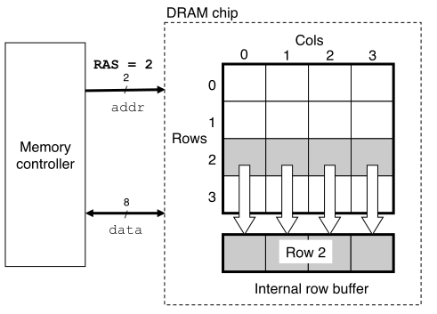
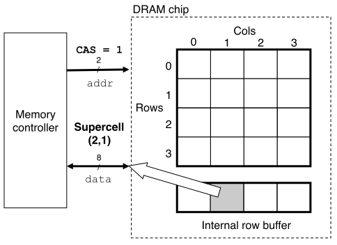
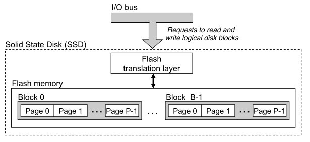
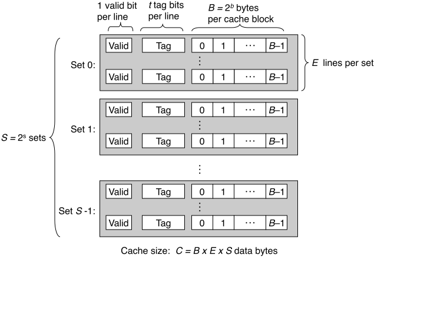

推荐译法：

|         英文          |           中文           |
| :-------------------: | :----------------------: |
|        memory         |  存储器、记忆体  |
|       hierarchy       |    等级体系、层次结构    |
|      main memory      | 主存（储器）、内存（条） |
|    virtual memory     |     虚拟内存（空间）     |
|    cache (memory)     |        缓存器        |
|   caching, staging    |        缓存、暂存        |
| store, write, output  |    存（储）、写（出）    |
| retrieve, read, input |    取（出）、读（入）    |

# 1. 存储器技术

## 1.1. RAM (Random Access Memory)

### SRAM (Static RAM)

速度较快，但价格昂贵，用于**缓存器 (cache)**。

SRAM 将每个位存储于具有两个稳定状态的**单元 (cell)** 中，
后者由含有六个晶体管的电路来实现，能够在通电时保持其所处的状态，对扰动不敏感。

### DRAM (Dynamic RAM)

速度较慢，但价格便宜，用于**主存储器 (main memory)**。

DRAM 将每个位以电荷形式存储于**电容 (capacitor)** 中，后者对扰动很敏感。
因此，存储系统必须周期地读、写其中的信息，以避免扰动破坏 DRAM 中的信息。

### 传统 DRAMs

每区块 DRAM 芯片被划分为 $d$ 个**超级单元 (supercell)**，每区块超级单元含 $w$ 个存储单元，故整区块 DRAM 芯片可存储 $d\times w$ 位信息。

所有超级单元被编为 $r$ 行、$c$ 列（含 $d = r \times c$ 个元素）的二维数组。

信息通过**针脚 (pin)** 传入、传出 DRAM：
- **数据针脚**：用于传输一个超级单元的数据。
- **地址针脚**：用于传输上述二维数组的地址。

读取第 $(r, c)$ 个超级单元中的数据分两步完成：
- **RAS (row access strobe)**：读取二维数组的第 $r$ 行数据，缓存于 DRAM 内部的缓冲区。
- **CAS (column access strobe)**：读取上述缓冲区内的第 $c$ 列数据。

| RAS | CAS |
|:---:|:---:|
|  |  |

这种二步寻址方式可以节省所需地址针脚对数量。

### 存储模区块

DRAM 芯片被打包为**存储模区块 (memory modules)**，俗称*内存条*，后者可插入**主板 (motherboard)** 的扩展槽中。

每个超级单元只能存储 1 字节信息，故每个 8 字节数据（`void *` 或 `double`）需由分布在 8 区块芯片上、具有相同二维地址的 8 个超级单元来存储。


位于存储模区块上的**存储控制器 (memory controller)** 负责
- 将内存地址翻译为 DRAM 芯片的二维地址。
- 将分布存储的 8 个字节组合成完整的 8 字节数据。

### 增强型 DRAMs

- Fast page mode DRAM (FPM DRAM)
- Synchronous DRAM (SDRAM)
- Double Data-Rate Synchronous DRAM (DDR SDRAM)
  - DDR
  - DDR2
  - DDR3
- Video RAM (VRAM)

### 非易变存储

DRAMs 及 SRAMs 仅能在通电时保存信息，因此是**易变的 (volatile)**。
能够将信息保存到断电后的存储设备被称为**非易变的 (non-volatile)**，它们在历史上也被称为**只读存储 (read-only memory, ROM)**。

| ROM 类型 | 写入次数 |
|:-------:|:-------:|
| programmable ROM (PROM) | $1$ |
| erasable PROM (EPROM) | $10^3$ |
| electrically  EPROM (EEPROM) | $10^5$ |

### 访问主存储器

**总线 (bus)**：连接 CPU 与主存储器或读写设备的共享电路。
- **系统总线 (system bus)**：连接 CPU 中的**总线接口 (bus interface)** 与**读写桥 (I/O bridge)**。
- **存储总线 (memory bus)**：连接*读写桥*与*主存储器*。
- **读写总线 (I/O bus)**：连接*读写桥*与**读写设备 (I/O devices)**。

## 1.2. 硬盘存储

**硬盘 (disk)** 的存储量大（RAM 的数千倍），但读写速度慢（DRAM 的数十万倍、SRAM 的数百万倍）。

### 硬盘几何

|                    盘片（俯视图）                     |                     柱面（侧视图）                     |
| :---------------------------------------------------: | :----------------------------------------------------: |
|  |  |


- **转轴 (spindle)**：以固定速率转动，转速通常为每分钟数千至上万转。
- **盘片 (platter)**：上下**盘面 (surface)** 覆盖磁性存储材料。
- **磁道 (track)**：盘面上的同心圆环。
- **柱面 (cylinder)**：同轴各盘面的所有直径相等的磁道。
- **扇区 (sector)**：磁道上的一段曲边梯形区域。每个扇区通常存储 512 字节数据。
- **间隔 (gap)**：扇区之间用于识别扇区的区域。

### 硬盘容量

$$
容量 =
\frac{\#字节}{扇区}\times
\frac{平均\#扇区}{磁道}\times
\frac{\#磁道}{盘面}\times
\frac{\#盘面}{盘片}\times
\frac{\#盘片}{硬盘}
$$


### 硬盘操作

机械部件：
- **读写头 (read/write head)**：
- **作动臂 (actuator arm)**：

时间参数：
- **查找时间 (seek time)**：移动摇臂使读写头位于所需磁道上方的时间，平均 3~9 ms。
- **旋转延迟 (rotational latency)**：所需扇区转到读写头下的时间，平均（30/RPM）约 4 ms。
- **传输时间 (transfer time)**：读写扇区数据的时间，远小于前两部分。

### 逻辑区块

**硬盘控制器 (disk controller)**
- 存储于硬盘**固件 (firmware)** 中。
- 负责维护**逻辑区块 (logical block)** 与**物理扇区 (physical sector)** 之间的映射。

### 连接读写设备


读写总线被设计为独立于 CPU，并且被所有所有设备共享：
- **USB (Universal Serial Bus)**：连接到鼠标、键盘、闪存等设备。
- **显卡 (graphics card)**：连接到显示器。
- **主机总线适配器 (host bus adapter)**：连接到硬盘控制器。
- **网络适配器 (network adapter)**：连接到网络。

### 访问硬盘

硬盘读取步骤：
1. CPU 向硬盘所关联到地址写入命令、逻辑区块编号、数据存储地址，以发起硬盘读取。在硬盘执行读取时，CPU 转去执行其他指令。
1. 硬盘控制器从扇区读取数据，将数据直接写入主存储器。这种绕过 CPU 的内存访问方式，称为**直接内存访问 (direct memory access, DMA)**。
1. 当 DMA 完成后，硬盘控制器向 CPU 发出[中断](./8_exceptional_control_flow.md)信号。CPU 收到该信号后，暂停执行其他指令。

## 1.3. 固态硬盘

**固态硬盘 (solid state disk, SSD)** 是一种基于**闪存 (flash memory)** 技术的存储设备。



数据以**页面 (page)** 为单位进行读写。各页面只有在其所属**区块 (block)** 被**擦除 (erase)** 后才能写入；被擦除的区块内，各页面可以被写入一次。每个区块大约可以被写入 $10^5$ 次；整区块 SSD 大约可以使用十年（连续读写）到几万年（日常读写）。

|      |              固态硬盘               |              机械硬盘               |
| :--: | :---------------------------------: | :---------------------------------: |
| 介质 |              闪存芯片               |              磁性盘片               |
| 映射 | 闪存翻译层（逻辑区块 ↦ 区块、页面） | 硬盘控制器（逻辑区块 ↦ 盘面、扇区） |
| 优点 |       安静、抗震、省电、快速        |                便宜                 |
| 缺点 |    可能**磨尽 (wear out)**、昂贵    |                 ……                  |

## 1.4. 发展趋势

- 速度越快，价格越贵，容量越小。
- 不同存储器技术的价格与性能的发展速度相差悬殊。
  - 速度提升有限，容量提升显著。
- DRAM 及硬盘的发展滞后于 CPU，且差距越拉越大。
  - 引入缓存机制，以弥合该差距。

# 2. 局部性

- **时间局部性 (temporal locality)**：刚刚被访问的地址，在不久的将来还会被多次访问。
- **空间局部性 (spatial locality)**：刚刚被访问的地址，其附近的地址在不久的将来会被访问。

## 2.1. 数据局部性

```c
int sumvec(int v[N]) {
  int i, s = 0;
  for (i = 0; i < N; i++)
    s += v[i];
  return s;
}
```

- 标量 `s` 有时间局部性，无空间局部性。
- 向量 `v` 有空间局部性，无时间局部性。

**$k$-步访问模式 (stride-$k$ reference pattern)**：对一段连续存储的元素，每访问完其中一个，向前跳 $k$ 步。
- 一般而言，$k$ 越大，局部性越差。
- 若 $k=1$，则又称作**顺序访问模式 (sequential reference pattern)**，此时空间局部性最优。

二维数组有以下两种访问顺序：
- **行优先顺序 (row-major order)**：内层循环访问同一行的各列，外层循环访问各行。
- **列优先顺序 (column-major order)**：……

## 2.2. 指令局部性

指令与数据类似，运行时也需要由 CPU 从内存中读取，因而也可以分析其局部性。

一般而言，循环体越短、循环次数越多，局部性越好。

# 3. 存储器等级体系

| 级别 |      名称      |    缓存对象     | 延迟（时钟周期） |
| :--: | :------------: | :-------------: | :--------------: |
|  0  |     寄存器     | 4 或 8 字节*词* |        0         |
|  1  |   L1 缓存器    |   64 字节*区块*   |        4         |
|  2  |   L2 缓存器    |   64 字节*区块*   |        10        |
|  3  |   L3 缓存器    |   64 字节*区块*   |        50        |
|  4  |    主存储器    |    4 KB *页*    |       200        |
|  5  |    本地磁盘    |      扇区       |     100,000      |
|  6  | 分布式文件系统 |      文件       |    10,000,000    |
|  7  |  互联网服务器  |      网页       |  1,000,000,000   |


## 3.1. 分级缓存

- **缓存器 (cache)**：用于在不同等级的存储设备之间暂存数据的设备。
- **缓存 (caching)**：使用缓存器暂存数据的过程。

基本概念：

- 第 $k+1$ 级存储器被划分为若干连续的**区块 (block)**，各区块以地址区分。
- 第 $k$ 级存储器也被划分为同样大小的区块，但区块的数量少于第 $k+1$ 级。
- 相邻两级存储器通过复制整个区块，维持上级所含区块为下级所含区块的子集。
- 区块的大小由相邻两级共享，且随等级升高（级别编号减小）而减小。

### 缓存命中

当程序需要从第 $k+1$ 级存储器中读取数据 $d$ 时，存储系统会先在第 $k$ 级存储器中查找。

**缓存命中 (cache hit)**：若数据 $d$ 恰好属于第 $k$ 级存储器中的某区块，则无需访问第 $k+1$ 级存储器。

### 缓存丢失

**缓存丢失 (cache miss)**：若数据 $d$ 不属于第 $k$ 级存储器中的任何区块，则需访问第 $k+1$ 级存储器。

访问完第 $k+1$ 级存储器后，可能需要修改第 $k$ 级存储器（替换其中某区块的数据）。
常用的*替换策略 (replacement policy)*有
- 随机选择某区块
- 最不常用的区块

### 缓存丢失分类

- **冷丢失 (cold miss)**：第 $k$ 级存储器的所有区块均为空。
- **冲突丢失 (conflict miss)**：取自第 $k+1$ 级存储器的不同区块，被映射到第 $k$ 级存储器的同一区块。
- **容量丢失 (capacity miss)**：存储器容量太小，不足以容纳**工作集 (working set)**。

### 缓存管理

各级存储器都需要有某种（硬件或软件）机制来管理缓存，其任务包括划分区块、判断是否命中、丢失后替换区块。

## 3.2. 概念小结

- *时间局部性*使得缓存于高级存储器的数据被重复利用，从而避免频繁访问低级存储器。
- *空间局部性*使得对低级存储器的昂贵访问得以**分摊 (amortize)** 到对相邻地址的访问。

# 4. 缓存器

## 4.1. 一般的缓存组织



|       描述        |   总数（个或字节）    |    位数     |
| :---------------: | :-------------------: | :---------: |
|     物理地址      |          $M$          | $m=\log_2M$ |
| 缓存集 / 缓存器 |          $S$          | $s=\log_2S$ |
| 缓存线 / 缓存集 |          $E$          |             |
| 区块偏移 / 缓存线 |          $B$          | $b=\log_2B$ |
|    缓存线标签     |                       |  $t=m-s-b$  |
|   缓存线有效性    |                       |     $1$     |
|    缓存器容量     | $C=B\times E\times S$ |             |

缓存可以按 $E$ 值来分类：
- 若 $E=1$，即每个缓存集内只有一条缓存线，则称其为**[直接映射的 (direct-mapped)](#direct-mapped)**。
- 若 $1<E<C/B$，则称其为**[$E$ 路集合关联的 ($E$-way set associative)](#set-associative)**。
- 若 $E=C/B$，即所有缓存线属于同一缓存集，则称其为**[完全关联的 (fully associative)](#fully-associative)**。

## 4.2. 直接映射（$E=1$）<a href id="direct-mapped"></a>

### 缓存集选择

以地址 $A$ 中（从右向左）第 $b$ 位起的 $s$ 位所表示的无符号整数，作为*缓存集*的序号。

### 缓存线匹配

该缓存集内只有一条*缓存线*。

若该缓存线的有效位非空，且地址 $A$ 中最高（左端）的 $t$ 位所表示无符号整数等于该缓存线的标签，则为*缓存命中*，否则为*缓存丢失*。

### 数据词选择

若缓存命中，则以地址 $A$ 中最低（右端）的 $b$ 位所表示无符号整数，作为所读数据词在当前缓存线内的的偏移量（起始字节编号）。

### 缓存线替换

若缓存丢失，则需从下一级存储器读取数据，并替换当前（无其他可选）缓存线内的数据。

### 冲突丢失

对于直接映射的缓存，冲突丢失容易在访问元素个数为 $2^n$ 的数组时发生。

```c
float dotprod(float x[8], float y[8]) {
  float sum = 0.0;
  for (int i = 0; i < 8; i++)
    sum += x[i] * y[i];  /* y[0,4) 可能冲掉 x[0,4) */
  return sum;
}
```

解决办法：在数组末尾补若干占位字节。

## 4.3. 集合关联（$1<E<C/B$）<a href id="set-associative"></a>

### 缓存集选择

同[直接映射的缓存](#direct-mapped)之*缓存集选择*。

### 缓存线匹配、数据词选择

每个*缓存集*可以被视为一个小型**关联存储器 (associative memory)**：

- **键 (key)**：有效位 + 标签位
- **值 (value)**：数据区块

当前缓存集内的任意一条缓存线都可能命中，故缓存器需遍历各缓存线。

### 缓存线替换

- 若尚有空闲的缓存线，则可任选其中之一。
- 若所有缓存线都非空，则可选择*任意*或*最不常用*或*最久未用*的一条。

## 4.4. 完全关联（$E=C/B$）<a href id="fully-associative"></a>

### 缓存集选择

因 $S=1$ 即 $s=0$，故 $m=t+b$ 即地址只分*缓存线标签*与*区块偏移量*两部分。

### 缓存线匹配、数据词选择

同[集合关联的缓存](#set-associative)之*缓存线匹配*及*数据词选择*。

由于硬件实现困难，完全关联的缓存通常规模较小。

## 4.5. 写出操作的问题

相对于读入操作，写出操作有其额外的问题：

对于**写出命中 (write hit)**，可采取的策略有
- **写穿 (write-through)**：立即写入下一级存储器。
- **写回 (write-back)**：直到当前缓存线被替换时，才写入下一级存储器。
  - 节省写出时间，但算法及实现复杂，且需维护额外的**污染位 (dirty bit)**。

对于**写出丢失 (write miss)**，可采取的策略有

- **写出分配 (write-allocate)**：先从下一级存储器读取相应的区块，再更新本级存储器的缓存线。
- **无写出分配 (no-write-allocate)**：绕过本级存储器的缓存，直接写入下级存储器。

建议：在没有文档可查的情况下，可假设缓存系统采用*向回写出*及*写出分配*策略。

- 越接近底层速度越慢，越值得采取该策略。
- 实现难度降低，符合发展趋势。
- 与读入策略对称。

## 4.6. 实际缓存器体系

- **指令缓存 (i-cache)**：只缓存指令，通常只读，故更简单。<a href id="i-cache"></a>
- **数据缓存 (d-cache)**：只缓存数据。
- **统一缓存 (unified-cache)**：二者兼顾。


Intel Core i7 处理器的三级缓存性能如下（三者的 $B$ 值均为 64 字节）：

|    名称     |   归属   |  $C$   | $E$  | $S$  |
| :---------: | :------: | :----: | :--: | :--: |
| L1 指令缓存 | 单核独享 | 32 KB  |  8   |  64  |
| L1 数据缓存 | 单核独享 | 32 KB  |  8   |  64  |
| L2 统一缓存 | 单核独享 | 256 KB |  8   | 512  |
| L3 统一缓存 | 多核共享 |  8 MB  |  16  | 8192 |

在 Linux 系统中，可以用 `lscpu` 命令查看上述信息：

```
Architecture:                    x86_64
CPU op-mode(s):                  32-bit, 64-bit
Byte Order:                      Little Endian
Address sizes:                   39 bits physical, 48 bits virtual
CPU(s):                          8
On-line CPU(s) list:             0-7
Thread(s) per core:              2
Core(s) per socket:              4
Socket(s):                       1
NUMA node(s):                    1
Vendor ID:                       GenuineIntel
CPU family:                      6
Model:                           60
Model name:                      Intel(R) Core(TM) i7-4790 CPU @ 3.60GHz
Stepping:                        3
CPU MHz:                         800.000
CPU max MHz:                     4000.0000
CPU min MHz:                     800.0000
BogoMIPS:                        7183.69
Virtualization:                  VT-x
L1d cache:                       128 KiB
L1i cache:                       128 KiB
L2 cache:                        1 MiB
L3 cache:                        8 MiB
NUMA node0 CPU(s):               0-7
Vulnerability ...
```

## 4.7. 缓存器参数对性能的影响

性能参数

- **丢失率 (miss rate)**：
- **命中率 (hit rate)**：
- **命中用时 (hit time)**：
- **丢失罚时 (miss penalty)**：

### 缓存区块大小（$B$ 值）的影响

$B$ 值大，有利于*空间局部性*，不利于*时间局部性*、*丢失罚时*。

### 缓存线数量（$E$ 值）的影响

$E$ 值大，有利于减少*冲突丢失*，但实现复杂、速度较慢。

存储器级别越低（丢失罚时越大）越适合用大的 $E$ 值。

### 写出策略的影响

存储器级别越低（写出用时越多）越适合用*写回*策略。

# 5. 编写缓存友好的代码

一般建议：关注核心函数内层循环；降低内存循环丢失率。

- 局部变量可以被缓存于寄存器中，有助于利用时间局部性。
- 单步访问模式充分利用各级缓存，有助于利用空间局部性。
  - 高维数组访问顺序应与存储顺序一致。

# 6. 缓存对程序性能的影响

## 6.1. 存储山


**读取吞吐量 (read throughput)** 或**读取带宽 (read bandwidth)**，即程序在单位时间内读取的数据量，常以 MB/s 为单位。

存储器系统的性能由程序的*时间局部性*与*空间局部性*共同决定，最大可相差若干数量级。

## 6.2. 重排循环以提高空间局部性

```c
/* Version ijk (medium) */
for (i = 0; i < n; i++)
  for (j = 0; j < n; j++) {
    sum = 0.0;
    for (k = 0; k < n; k++)
      sum += A[i][k] * B[k][j];  /* 2 loads, 0 stores, 1.25 misses */
    C[i][j] += sum;
  }
/* Version jki (worst) */
for (j = 0; j < n; j++)
  for (i = 0; i < n; i++) {
    Bkj = B[k][j];
    for (k = 0; k < n; k++)
      C[i][j] += A[i][k] * Bkj;  /* 2 loads, 1 stores, 2.00 misses */
  }
/* Version kij (best) */
for (k = 0; k < n; k++)
  for (i = 0; i < n; i++) {
    Aik = A[i][k];
    for (j = 0; j < n; j++)
      C[i][j] += Aik * B[k][j];  /* 2 loads, 1 stores, 0.50 misses */
  }
```

*丢失率*比*访存次数*更宜作为性能指标。

## 6.3. 利用局部性

- 关注最内层循环，尽量降低丢失率及访存次数。
- 遍历数组时步长尽量为一，以利用空间局部性。
- 取出对象后尽量充分利用，以利用时间局部性。

