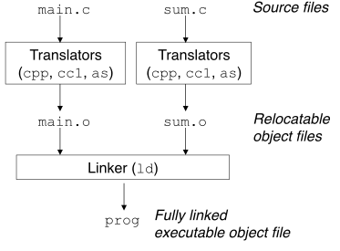
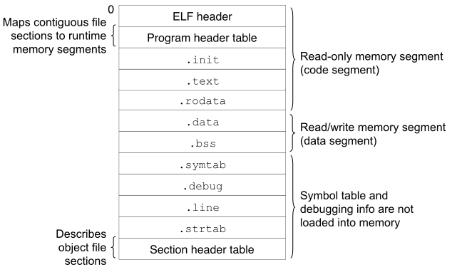
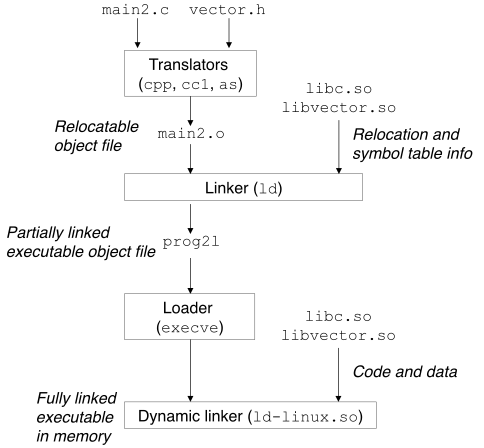
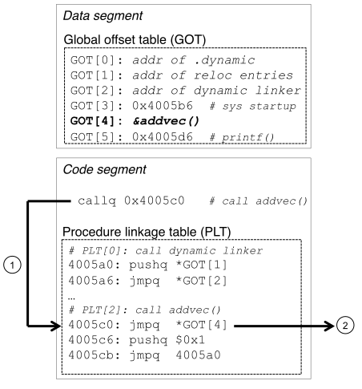

# 1. 编译器驱动器

**编译器驱动器 (compiler driver)**：`gcc -v -Og -o prog main.c sum.c`

- **预处理器 (preprocessor)**：`cpp [other args] main.c /tmp/main.i`
- **编译器 (compiler)**：`cc1 /tmp/main.i -Og [other args] -o /tmp/main.s`
- **汇编器 (assembler)**：`as [other args] -o /tmp/main.o /tmp/main.s`
- **链接器 (linker)**：`ld -o prog [system object files and args] /tmp/main.o /tmp/sum.o`

**加载器 (loader)**：`./prog`

- 先将可执行文件中的代码及数据复制到内存中。
- 再将控制权转移到该程序 `main()` 头部。



# 2. 静态链接

**静态链接器 (static linker)**：

- **符号解析 (symbol resolution)**：
  - **符号**：函数、全局变量、静态变量
  - **解析**：为每个符号**引用 (reference)** 关联唯一的符号**定义 (definition)**
- **[搬迁 (relocation)](#relocate)**：为每个符号*定义*关联唯一的内存地址，将所有对该符号的*引用*修改为此地址。


# 3. 目标文件

**目标文件 (object file)**：存储在硬盘上的**目标模块 (object module)**，后者泛指一段字节序列。

- **[可搬迁的 (relocatable)](#relocatable)**：
- **[可执行的 (executable)](#executable)**：
- **[共享的 (shared)](#pic)**：

**目标文件格式**：

- **Unix**：`a.out` format
- **Windows**：PE (Portable Executable) format
- **macOS**：Mach-O format
- **x86-64 Linux**：ELF (Executable and Linkable Format)

# 4. 可搬迁目标文件<a href id="relocatable"></a>


- **ELF header**：词长 (word size)、字节顺序 (byte ordering)、ELF header 长度、目标文件类型、机器类型、section header table 的位置及所含 sections 的数量。
- **`.text`**：可执行程序的机器码
- **`.rodata`**：只读数据（字符串常量、`switch` 跳转表）
- **`.data`**：初值非零的全局变量
- **`.bss`**：未初始化的静态变量或初值为零的全局或静态变量（不占实际空间）
  - Block Started by Symbol
  - Better Save Space
- **`.symtab`**：函数、全局变量的符号列表，不含局部变量
- **`.rel.text`**：`.text` 中有待链接器修改的位置（外部函数、全局变量）的列表
- **`.rel.data`**：初值（如：外部函数或全局变量的地址）待定的全局变量
- **`.debug`**：调试信息（编译时开启 `-g` 才有）
- **`.line`**：源代码位置与指令位置的映射（编译时开启 `-g` 才有）
- **`.strtab`**：用于 `.symtab` 及 `.debug` 中符号表的字符串列表
- **section header table**：除以上 sections 外，（可搬迁的目标文件）还有三个预留 sections：
  - **`ABS`**：本地全局符号
  - **`UNDEF`**：外部全局符号
  - **`COMMON`**：未初始化的全局变量（区别于 `.bss`），即[弱符号](#weak-symbol)

# 5. 符号、符号列表

对于链接器，有三种符号：

- 当前模块定义的全局符号（non`static` 函数、全局变量）
- 其他模块定义的全局符号（non`static` 函数、全局变量）
- 只在当前模块内出现的局部符号（`static` 函数、`static` 变量）

```c
// 不同函数中的局部 `static` 变量对应不同链接符号
int f() { static int x = 0; return x; }
int g() { static int x = 1; return x; }
```

符号列表由汇编器创建，各条目格式如下，可以用 GNU `readref` 程序查看：

```c
typedef struct {
  int name;      /* String table offset */
  char type:4,   /* Function or data (4 bits) */
    binding:4;   /* Local or global (4 bits) */
  char reserved; /* Unused */
  short section; /* Section header index */
  long value;    /* Section offset or absolute address */
  long size;     /* Object size in bytes */
} Elf64_Symbol;
```

# 6. 符号解析

全局符号解析的一般规则：

- 若当前模块内没有定义，则假设其定义在其他模块中。
- 若多个模块有重复定义，则可能报错或从中选择一个。

## 6.1. 同名符号的解析

- **强符号 (strong symbol)**：函数、有初值的全局变量
- **弱符号 (weak symbol)**：无初值的全局变量<a href id="weak-symbol"></a>

⚠️ C++ 中 `class` 的重载方法有不同的符号名，例如 `Foo::bar(int, long)` 的符号名为 `bar__3Fooil`。

链接规则：

1. 强符号不能同名。
2. 一强多弱，则取一强。
3. 零强多弱，任取一若。

## 6.2. 静态库的链接

**静态库 (static library)**：打包一组目标文件所得的输出文件。

- **Linux**：文件名后缀为 `.a`，意为 **a**rchive


链接规则：创建可执行文件时，从静态库中复制被引用的目标代码区块。

```shell
gcc -c addvec.c multvec.c main2.c
ar rcs libvector.a addvec.o multvec.o
gcc -static -o prog2c main2.o ./libvector.a
# 或等价的
gcc -static -o prog2c main2.o -L. -lvector
```

其中 `-static` 表示生成**完全链接的 (fully linked)** 可执行文件，该文件在当前文件系统的任何位置都能运行。

## 6.3. 用静态库解析引用

自左向右扫描命令行参数列表中的可搬迁目标文件或静态库：

- 若遇到可[搬迁](#relocate)目标文件，则将其放入待[搬迁](#relocate)文件列表 $E$，并更新未定义符号列表 $U$ 及已定义符号列表 $D$。
- 若遇到静态库，则遍历其中的成员（可[搬迁](#relocate)目标文件）。若某成员可以解析 $U$ 中的成员（未定义符号），则将其放入 $E$，并更新 $U$ 及 $D$。
- 最后，若 $U$ 为空，则合并及[搬迁](#relocate) $E$ 中的文件以生成可执行文件；否则，链接器报错并结束运行。

⚠️ 链接是否成功及输出结果，依赖于各文件在命令行参数列表中的顺序。

```shell
# foo.c 调用 libx.a 中的函数 f，f 调用 liby.a 中的 g，g 调用 libx.a 中的函数 h
gcc foo.c libx.a liby.a libx.a # OK
gcc foo.c libx.a liby.a        # Error: h undefined
gcc foo.c        liby.a libx.a # Error: g undefined
```

# 7. 搬迁<a href id="relocate"></a>

**搬迁 (relocation)** 分两步：

1. 搬迁字段及符号定义：将分散在各目标文件中的同类字段合并，并计算所有符号的运行期地址。
2. 搬迁符号引用：将所有符号引用替换为运行期地址。

## 7.1. 搬迁条目

汇编器为每个符号引用创建一个“搬迁条目 (relocation entry)”，结构如下：

```c
typedef struct {
  long offset;  /* Offset of the reference to relocate */
  long type:32, /* Relocation type */
     symbol:32; /* Symbol table index */
  long addend;  /* Constant part of relocation expression */
} Elf64_Rela;
```

其中 `type` 多达 32 种，常用的有：

- **`R_X86_64_PC32`**：用相对于 [PC](./3_machine_level_programming.md#PC) 的 32-bit 地址搬迁
- **`R_X86_64_32`**：用 32-bit 绝对地址搬迁

⚠️ 以上两种 `type` 只支持不超过 2 GB 的可执行文件。

## 7.2. 搬迁符号引用

```c
foreach section s {
  foreach relocation_entry r {
    ref_ptr = ADDR(s) + r.offset;
    if (r.type == R_X86_64_PC32) { /* PC-relative reference */
      pc_value = ref_ptr - r.addend; /* %rip */
      *ref_ptr = (unsigned) (ADDR(r.symbol) - pc_value);
    }
    if (r.type == R_X86_64_32) { /* absolute reference */
      *ref_ptr = (unsigned) (ADDR(r.symbol) + r.addend);
    }
  }
}
```

# 8. 可执行目标文件<a href id="executable"></a>



可执行目标文件的格式与[可搬迁目标文件](#relocatable)类似，但有以下区别：

- ELF header 还包括当前程序第一条指令的地址。
- 多一个 `.init` 字段，内含 `_init()` 的定义，用于启动程序。
- 已完全链接，故无需 `.rel` 字段。

# 9. 加载可执行目标文件

**加载 (loading)**：分以下几步：

1. Shell 用 [`fork()`](./8_exceptional_control_flow.md#fork) 创建子进程，在其中用 [`execve()`](./8_exceptional_control_flow.md#execve) 启动加载器。
2. 加载器从硬盘读取可执行文件，创建下图所示[虚拟内存](./9_virtual_memory.md)空间（只分配空间，不读取数据）。
3. 运行系统文件 `crt1.o` 中 `_start()`，在其中调用标准库 `libc.so` 中的 `__libc_start_main()`，后者最终将控制权移交给应用程序的 `main()`。


# 10. 动态链接共享库

|            |        静态链接        |        动态链接        |
| :--------: | :--------------------: | :--------------------: |
| 库函数代码 | 每个可执行文件独享一份 | 所有可执行文件共享一份 |
| 可执行文件 |   链接后独立于库文件   |  链接后仍依赖于库文件  |
| 库函数更新 |   必须重新编译、链接   |     支持运行时更新     |



```shell
gcc -shared -fpic -o libvector.so addvec.c multvec.c
gcc -o prog2l main2.c ./libvector.so
```

- **`-fpic`**：生成[位置无关代码](#pic)
- **`-shared`**：生成共享的目标文件

**基本思想**：

- 创建可执行文件时，静态地完成部分链接（搬迁条目、符号列表）。
- 启动（加载）程序时，动态地完成剩余链接（搬迁代码、数据）。

# 11. 运行期加载并链接共享库

共享库的加载和链接，甚至可以推迟到应用程序启动后（运行时）。

```c
#include <dlfcn.h>
void *dlopen(const char *filename/* so */,
             int flag/* RTLD_GLOBAL | RTLD_NOW | RTLD_LAZY */);
    // Returns: pointer to handle if OK, NULL on error
void *dlsym(void *handle/* opened so */, char *symbol);
    // Returns: pointer to symbol if OK, NULL on error
int dlclose (void *handle);
    // Returns: 0 if OK, −1 on error
const char *dlerror(void);
    // Returns: error message if previous call to 
    // dlopen, dlsym, or dlclose failed; NULL if previous call was OK
```

- 以 `dlopen()` 加载的共享库中的外部符号，用之前以 `RTLD_GLOBAL` 加载的库进行解析。
- 传给 `dlsym()` 的第一个实参可以是以下两个预设的 pseudo-handles 之一
  - **`RTLD_DEFAULT`**：按默认库搜索顺序，找到 `symbol` 第一次出现的位置。
  - **`RTLD_NEXT`**：在当前库之后按搜索顺序，找到 `symbol` 下一次出现的位置。
- 若编译可执行文件时开启 `-rdynamic`，则可执行文件中的全局符号也可用于符号解析。

```c
/* dll.c
 * gcc -rdynamic -o prog2r dll.c -ldl
 */

#include <stdio.h>
#include <stdlib.h>
#include <dlfcn.h>

int x[2] = {1, 2}; int y[2] = {3, 4};
int z[2];

int main() {
  void *handle;
  void (*addvec)(int *, int *, int *, int);
  char *error; 

  /* Dynamically load the shared library that contains addvec() */
  handle = dlopen("./libvector.so", RTLD_LAZY);
  if (!handle) {
    fprintf(stderr, "%s\n", dlerror()); exit(1);
  }

  /* Get a pointer to the addvec() function we just loaded */
  addvec = dlsym(handle, "addvec");
  if ((error = dlerror()) != NULL) {
    fprintf(stderr, "%s\n", error); exit(1);
  }

  /* Now we can call addvec() just like any other function */
  addvec(x, y, z, 2);
  printf("z = [%d %d]\n", z[0], z[1]);

  /* Unload the shared library */
  if (dlclose(handle) < 0) {
    fprintf(stderr, "%s\n", dlerror()); exit(1);
  }
  return 0;
}
```

# 12. 位置无关代码<a href id="pic"></a>

**位置无关代码 (Position-Independent Code, PIC)**：为节约[物理内存](./9_virtual_memory.md#memory-map)，共享库中的 `.text` 字段应当能够被所有使用它的进程共享，故代码段中不能显式含有全局符号的地址。

- 用 `gcc` 生成 PIC 时，必须开启 `-fpic` 选项。
- 用 `gcc` 生成共享库时，必须开启 `-shared` 选项。

## PIC 数据访问

无论目标模块被加载到何处，其（当前进程私有的）数据段与（所有进程共享的）代码段之间的距离是一个常量。利用此性质，编译器在该模块的数据段开头创建一个 **GOT (Global Offset Table)**：

- 表中各项长 8 字节，分别对应一个全局数据（如 `GOT[3]` 对应（可能定义在其他模块中的）全局变量 `addcnt`）。
- 加载时，动态链接器会将 `GOT[i]` 修改为其对应的全局数据的绝对地址（如 `GOT[3]` 被修改为 `&addcnt`）。
- 运行时，通过解引用 `GOT[i]` 中的地址，间接访问全局数据（如 `addcnt++` 由 `(**GOT[3])++` 实现）。


## PIC 函数调用

若某个目标模块调用了共享库里的函数，则该模块同时拥有以下两个列表：

- **PLT (Procedure Linkage Table)**：位于代码段，每项长 16 字节。
  - `PLT[0]` 为调用动态链接器的指令。
  - `PLT[1]` 为调用 `__libc_start_main()` 的指令。
  - `PLT[2]` 起为借助 `GOT[]` 跳转到用户代码的指令。
- **GOT (Global Offset Table)**：位于数据段，每项长 8 字节。
  - `GOT[0], GOT[1]` 用于解析被调函数的地址。
  - `GOT[2]` 为动态链接器的入口（位于 `ld-linux.so` 中）。
  - `GOT[4]` 起为被调函数的地址，与 `PLT[]` 的成员一一对应。

**lazy binding**：将函数地址绑定延迟到首次调用该函数时：

1. 首次调用前，`GOT[4]` 指向 `PLT[2]` 的第二条指令。
2. 首次调用时，`GOT[4]` 被动态链接器修改为 `addvec()` 的入口。
3. 后续调用时，`PLT[2]` 只执行第一条指令，即跳转至  `addvec()` 的入口。

|                      首次调用                       |                      后续调用                       |
| :-------------------------------------------------: | :-------------------------------------------------: |
|  |  |

# 13. 库打桩

**库打桩 (library interpositioning)**：将对“目标函数”的调用，替换为对“封装函数”的调用。

- **目标函数 (target function)**：被换出的函数（如标准库中的 `malloc(), free()`）。
- **封装函数 (wrapper function)**：被换入的函数（如 `malloc.h` 中的 `mymalloc(), myfree()`），与目标函数有相同的函数原型，通常在调用目标函数前后做一些处理。

```c
/* int.c */
#include <stdio.h>
#include <malloc.h>

int main() {
  int *p = malloc(32);
  free(p);
  return(0);
}

/* malloc.h */
#define malloc(size) mymalloc(size)
#define free(ptr) myfree(ptr)

void *mymalloc(size_t size);
void myfree(void *ptr);
```

## 13.1. 编译期替换

```c
/* mymalloc.c */
#ifdef COMPILETIME
#include <stdio.h>
#include <malloc.h>

void *mymalloc(size_t size) {
  void *ptr = malloc(size); 
  printf("malloc(%d)=%p\n", (int)size, ptr); 
  return ptr;
}

void myfree(void *ptr) {
  free(ptr);
  printf("free(%p)\n", ptr); 
}
#endif
```

```shell
$ gcc -DCOMPILETIME -c mymalloc.c
$ gcc -I. -o intc int.c mymalloc.o
$ ./intc
malloc(32)=0x9ee010
free(0x9ee010)
```

其中

- **`-DCOMPILETIME`**：表示定义预处理宏 `COMPILETIME`。
- **`-I.`**：表示先在当前目录内寻找头文件 `malloc.h`。

## 13.2. 链接期替换

```c
/* mymalloc.c */
#ifdef LINKTIME
#include <stdio.h>

void *__real_malloc(size_t size);
void __real_free(void *ptr);

void *__wrap_malloc(size_t size) {
  void *ptr = __real_malloc(size); /* Call libc malloc */
  printf("malloc(%d) = %p\n", (int)size, ptr);
  return ptr;
}

void __wrap_free(void *ptr) {
  __real_free(ptr); /* Call libc free */
  printf("free(%p)\n", ptr);
}
#endif
```

```shell
$ gcc -DLINKTIME -c mymalloc.c
$ gcc -c int.c
$ gcc -Wl,--wrap,malloc -Wl,--wrap,free -o intl int.o mymalloc.o
$ ./intl
malloc(32) = 0x18cf010
free(0x18cf010)
```

其中

- **`-Wl,option`**：表示向静态链接器传递 `option`（`option` 中的 `,` 被替换为空格）。
- **`-Wl,--wrap,func`**：表示在静态链接时，将
  - 对 `func()` 的引用解析为 `__wrap_func()`。
  - 对 `__real_func()` 的引用解析为 `func()`。

## 13.3. 运行期替换

```c
#ifdef RUNTIME
#define _GNU_SOURCE
#include <stdio.h>
#include <stdlib.h>
#include <dlfcn.h>

void *malloc(size_t size) {
  void *(*mallocp)(size_t size);
  char *error;

  mallocp = dlsym(RTLD_NEXT, "malloc"); /* Get address of libc malloc */
  if ((error = dlerror()) != NULL) {
    fputs(error, stderr); exit(1);
  }
  char *ptr = mallocp(size); /* Call libc malloc */
  printf("malloc(%d) = %p\n", (int)size, ptr);
  return ptr;
}

void free(void *ptr) {
  void (*freep)(void *) = NULL;
  char *error;

  if (!ptr)
    return;

  freep = dlsym(RTLD_NEXT, "free"); /* Get address of libc free */
  if ((error = dlerror()) != NULL) {
    fputs(error, stderr); exit(1);
  }
  freep(ptr); /* Call libc free */
  printf("free(%p)\n", ptr);
}
#endif
```

```shell
$ gcc -DRUNTIME -shared -fpic -o mymalloc.so mymalloc.c -ldl
$ gcc -o intr int.c
$ LD_PRELOAD="./mymalloc.so" ./intr
malloc(32) = 0x1bf7010
free(0x1bf7010)
```

其中

- **`LD_PRELOAD="./mymalloc.so"`**：表示在动态链接时，优先用 `./mymalloc.so` 来解析符号。
- **`./intr`**：可以替换为任何动态链接的可执行文件。

# 14. 操作目标文件的工具

## `ar`

创建静态库，插入、删除、列出、提取成员

## `strings`

列出所有可打印字符串

## `strip`

删除符号列表信息

## `nm`

列出所有符号

## `size`

列出目所有字段的名称和大小

## `readelf`

显示目标文件的完整结构

## `objdump`

显示所有信息，常用于显示 `.text` 中二进制指令的反汇编代码

## `ldd`

列出某个可执行文件运行时所需的共享库

# [全书目录](../csapp.md#全书目录)
