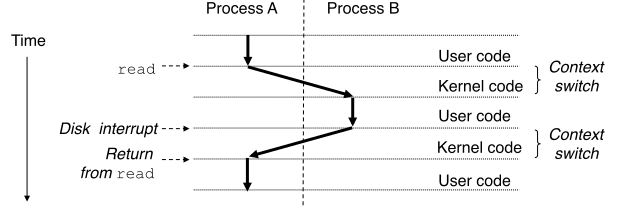
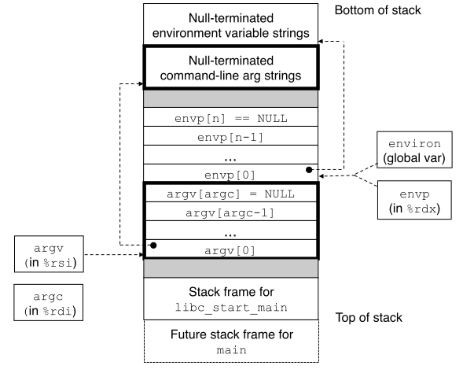
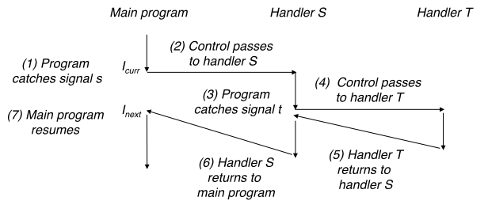

推荐译法：

|         英文          |           中文           |
| :-------------------: | :----------------------: |
|        exception        |     异常     |
|   interrupt   |     中断     |
|     fault     |     故障     |
| error | 错误 |
|    handle, handler    |     处置、处置器     |
|       reap       |     收割     |
|      concurrent      | 并发的 |
| parallel |     并行的     |
| abort | 终止 |
| exit | 退出 |
| stop, suspend | 停止、暂停 |
|   terminate   |    结束    |


- **控制转移 (control transfer)**：**程序计数器 (program counter, PC)** 的值由一条指令的地址变为下一条指令的地址的过程。
- **控制流 (control flow)**：由*控制转移*构成的序列。
  - 【常规控制流】除依次执行相邻指令的光滑控制流外，只含有由*跳转*、*调用*、*返回*等指令引起的控制流突变。
  - **异常控制流 (exceptional control flow, ECF)**：含有由不能被程序内部变量捕捉的（甚至与程序执行无关的）系统状态变化引起的控制流突变。

理解 ECF 有助于
- 理解重要系统概念（[读写](./10_system_level_io.md)、[进程](#process)、[虚拟内存](./9_virtual_memory.md)）
- 理解应用程序与操作系统的交互
- 编写应用程序（shell、网络服务器）
- 理解**并发 (concurrency)**
- 理解**软件异常 (software exceptions)** 的工作原理

# 1. 异常

- **事件 (event)**：处理器状态的某种显著的变化。
  - 可能由当前指令有关，如：访存发生**页面故障 (page fault)**。
  - 也可能与当前指令无关，如：读写请求完成。
- **异常 (exception)**：由某个*事件*引起的控制流突变。

当处理器检测到某个事件发生时，它会将 PC 设为存储在**异常表 (exception table)** 中的某个地址。
该地址指向用于响应该事件的某个系统子程序，即**异常处置器 (exception handler)**。
此机制被称为**间接过程调用 (indirect procedure call)**。

## 1.1. 异常处置

- **异常编号 (exception number)**：
  - 用于标识异常的非负整数
  - 其中一些由处理器设计者定义，如：浮点错误（除以零）、页面故障、非法访存。
  - 其余由操作系统内核设计者定义，如：系统调用、读写信号。
- **异常表 (exception table)**：
  - 在系统启动时，由操作系统分配并初始化，表头地址存于特定寄存器中。
  - 其中第 $k$ 项为*事件 $k$* 的异常处置器（的地址）。

|          |       异常（间接过程调用）       |  函数（普通过程调用）  |
| :------: | :------------------------------: | :--------------------: |
| 返回地址 | 可能为当前指令或下一条指令的地址 |  总是下一条指令的地址  |
| 压栈内容 |      可能包括其他处理器状态      | 调用者负责保存的寄存器 |
| 栈所有者 |             系统内核             |        用户程序        |
| 执行模式 |       内核模式（访问无限）       |  用户模式（访问受限）  |

## 1.2. 异常分类

- **异步 (asynchronous)**：并非由正在执行的指令引起
  - **中断 (interrupt)**：处理器收到读写设备发出的信号
- **同步 (synchronous)**：由正在执行的指令引起
  - **陷阱 (trap)**：应用程序调用系统子程序
  - **故障 (fault)**：发生可以被修复的错误
  - **终止 (abort)**：发生不可被修复的错误

### 中断


1. 执行指令 $I_\text{curr}$ 时，处理器收到读写设备（网络适配器、硬盘控制器、计时器）发来的信号。
2. 待 $I_\text{curr}$ 执行完后，控制权转移到**中断处置器 (interrupt handler)**，并运行之。
4. 返回到紧随 $I_\text{curr}$ 的下一条指令 $I_\text{next}$。

### 陷阱


1. 应用程序通过 `syscall` 指令调用系统子程序。
2. 控制权转移到**陷阱处置器 (trap handler)**，并运行之。
3. 返回到紧随 `syscall` 的下一条指令 $I_\text{next}$。

### 故障


1. 执行指令 $I_\text{curr}$ 时，发生**故障 (fault)**。
2. 控制权转移到**故障处置器 (fault handler)**，并运行之。
3. 若成功排除故障，则返回到引起故障的 $I_\text{curr}$ 并重新执行；否则终止该程序。

### 终止


1. 执行指令 $I_\text{curr}$ 时，发生不可修复的**致命错误 (fatal error)**。
2. 控制权转移到**终止处置器 (abort handler)**，并运行之。
3. 返回到 `abort` 以终止当前程序的执行。

## 1.3. Linux/x86-64 系统的异常

### 故障及终止

|  编号   |        描述        |    分类    |
| :-----: | :----------------: | :--------: |
|    0    |      除法溢出      |    故障    |
|   13    |      非法访存      |    故障    |
|   14    |      页面故障      |    故障    |
|   18    |      硬件错误      |    终止    |
| 32～255 | 操作系统定义的异常 | 中断、陷阱 |

### 系统调用<a href id="syscall"></a>

- **系统级函数 (system-level functions)**：形如函数的系统调用（或其封装）。
- **陷阱指令 (trap instruction)**：名为 `syscall` 的 x86-64 指令。
  - 寄存器 `rax` 存储系统调用编号。
  - 寄存器 `rdi`, `rsi`, `rdx`, `r10`, `r8`, `r9` 依次存储第一到六个实参。

| 编号 |   名称   |         描述         |
| :--: | :------: | :------------------: |
|  0   |  `read`  |                      |
|  1   | `write`  |                      |
|  2   |  `open`  |                      |
|  3   | `close`  |                      |
|  4   |  `stat`  |     获取文件信息     |
|  9   |  `mmap`  | 将内存页面映射到文件 |
|  12  |  `brk`   |       重设堆顶       |
|  32  |  `dup2`  |    复制文件描述符    |
|  33  | `pause`  |  暂停进程，等待信号  |
|  37  | `alarm`  |  安排闹钟信号的发送  |
|  39  | `getpid` |                      |
|  57  |  `fork`  |                      |
|  59  | `execve` |                      |
|  60  | `_exit`  |       终止进程       |
|  61  | `wait4`  |   等待某个进程终止   |
|  62  |  `kill`  |  向某个进程发送信号  |

# 2. 进程<a href id="process"></a>

- **进程 (process)**：运行中的程序实例。
- **上下文 (context)**：程序正确运行所需的状态，包括
  - 内存中的代码及数据
  - 运行期栈
  - 通用寄存器的内容
  - 程序计数器
  - 环境变量
  - 已打开文件的描述符

## 2.1. 逻辑控制流

**逻辑控制流 (logical control flow)**：简称*逻辑流*，是指由程序计数器的值构成的序列（即指令地址构成的序列）。

该机制使得当前程序看上去像是*独占了处理器*。

## 2.2. 并发流

**并发流 (concurrent flow)**：运行时间有重叠的多个逻辑流。
- **多任务 (multitasking)**：多个进程轮流执行片段，又名**时间分割 (time slicing)**。狭义的『并发』特指这种类型。
- **并行流 (parallel flow)**：运行在多个核心或计算机上的并发流。

## 2.3. 私有地址空间

- **地址空间 (address space)**：由 $0$ 到 $(2^n-1)$ 共 $2^n$ 个地址构成的集合。
- **私有 (private)**：每个进程只能读写自己的地址空间。
- 不同进程的私有地址空间，有相同的组织（结构）。

该机制使得当前程序看上去像是*独占了存储器*。

## 2.4. 用户与内核模式

- **模式位 (mode bit)**：存于特定寄存器中，表示当前进程的权限。
- **内核模式 (kernel mode)**：模式位非空，可以执行任何指令、访问任何地址。
- **用户模式 (user mode)**：模式位为空，只能执行部分指令、访问部分地址。

应用程序的进程，启动时处于用户模式；要变为内核模式，只能通过异常。

Linux 允许用户模式的进程通过 `/proc` 文件系统访问内核数据结构的内容，如

- `/proc/cpuinfo` 表示处理器信息
- `/proc/PID/maps` 表示某个进程的[内存映射](./9_virtual_memory.md#memory-map)

## 2.5. 上下文切换

**抢占 (preempt)**：暂停

**调度 (scheduling)**：操作系统内核决定是否暂停当前进程、恢复之前被抢占的进程。

**上下文切换 (context switch)**：

1. 保存当前进程的上下文
2. 恢复之前被抢占的进程的上下文
3. 移交控制权



可能发生于

- 需要较长时间才能返回的系统调用之后
  - `read`
  - `sleep`
- 周期性的计时器中断之后
- 中断处置器返回之后

# 3. 系统调用错误处理

系统调用发生错误时，通常返回 `-1` 并将整型全局变量 `errno` 设为错误编号。

原则上，系统调用返回时都应检查是否发生了错误：

```c
if ((pid = fork()) < 0) {
  fprintf(stderr, "fork error: %s\n", strerror(errno));
  exit(0);
}
```

其中 `strerror(errno)` 返回 `errno` 的字符串描述。

利用**错误报告函数 (error-reporting function)**

```c
void unix_error(char *msg) {  /* Unix-style error */
  fprintf(stderr, "%s: %s\n", msg, strerror(errno));
  exit(0);
}
```

可将上述系统调用及错误检查简化为

```c
if ((pid = fork()) < 0)
  unix_error("fork error");
```

更进一步，本书作者提供了一组**错误处置封装 (error-handling wrapper)**。
其中每个封装的形参类型与相应的原始函数一致，只不过将函数名的首字母改为大写：

```c
/* csapp.c */
pid_t Fork(void) {
  pid_t pid;
  if ((pid = fork()) < 0)
    unix_error("Fork error");
  return pid;
}
```

使用时只需一行代码：

```c
#include "csapp.h"
pid = Fork();
```

# 4. 进程控制

## 4.1. 获取 PID

每个进程都有一个唯一的由正整数表示的**进程身份 (process ID, PID)**。

```c
#include <sys/types.h>
#include <unistd.h>
pid_t getpid(void);   // 当前进程的 PID
pid_t getppid(void);  // parent's PID
```

其中 `pid_t` 为定义在 `sys/types.h` 中的整数类型，Linux 将其定义为 `int`。

## 4.2. 创建、结束进程<a href id="fork"></a>

进程可能处于**运行 (running)**、**暂停 (stopped)**、**结束 (terminated)** 三种状态之一。

结束进程：

```c
#include <stdlib.h>
void exit(int status);
```

在**亲进程 (parent process)** 中创建**子进程 (child process)**：

```c
#include <sys/types.h>
#include <unistd.h>
pid_t fork(void);
```

子进程刚被创建时，几乎与亲进程有相同的上下文（用户级[虚拟内存](./9_virtual_memory.md)空间、已打开文件的描述符）。

函数 `fork()` 有两个返回值：在子进程中返回 `0`，在亲进程中返回子进程的 PID。

**进程图 (process graph)**：

- 每个**结点 (vertex)** 表示一条语句，结点之间的依赖关系 $a\to b$ 表示*语句 $a$ 在语句 $b$ 之前运行*。
- 构成 **DAG (Directed Acyclic Graph)**，表示（有从属关系的）不同进程的语句之间的偏序关系。
- 实际执行顺序可能是所有结点的任何有效的**拓扑排序 (topological sort)**。


```c
#include "csapp.h"
int main() { Fork(); Fork(); printf("hello\n"); exit(0); }
```

## 4.3. 收割子进程

**僵尸 (zombie)**：已**结束 (terminated)** 但未被**收割 (reap)** 的进程。<a href id="zombie"></a>

`init` 的 PID 为 `1`，是所有进程的祖先。它负责在亲进程结束时，收割其僵尸子进程。

⚠️ shell 等生存期较长的进程，应当主动收割其子进程。

```c
#include <sys/types.h>
#include <sys/wait.h>
pid_t waitpid(pid_t pid, int *statusp, int options);
```

默认（即 `options == 0` 时）行为：暂停当前进程，直到**等待集 (wait set)** 中的某个子进程结束，返回该子进程的 PID。

### 确定等待集的成员

- 若 `pid > 0` ，则等待集只含以 `pid` 为 PID 的子进程。
- 若 `pid == -1` ，则等待集由该亲进程的所有子进程组成。

### 修改默认行为

`options` 可设为以下值或它们的**位或 (bitwise OR)** 值：

- `WNOHANG` 立即返回（若被等待的子进程未结束，则返回 `0`）。
- `WUNTRACED` 等待某个子进程*结束*或*暂停*。
- `WCONTINUED` 等待某个子进程*结束*，或某个暂停的子进程被 `SIGCONT` 信号*恢复*。

### 检查被收割子进程的退出状态

若 `statusp != NULL`，则会向其写入 `status` 的值。
`status` 的值不应直接使用，而应当用以下**宏 (macro)** 解读：

- `WIFEXITED(status)` 返回：被等待子进程是否正常结束
  - `WEXITSTATUS(status)` 返回：被等待子进程的退出状态
- `WIFSIGNALED(status)` 返回：被等待子进程是否因[信号](#signal)而*结束*
  - `WTERMSIG(status)` 返回：导致被等待子进程结束的[信号](#signal)
- `WIFSTOPPED(status)` 返回：被等待子进程是否因[信号](#signal)而*暂停*
  - `WSTOPSIG(status)` 返回：导致被等待子进程暂停的[信号](#signal)

更多宏可用 `man waitpid` 命令查询。

### 错误条件

- 若当前进程没有子进程，则将 `errno` 设为 `ECHILD` 并返回 `-1`。
- 若等待时收到中断信号，则将 `errno` 设为 `EINTR` 并返回 `-1`。

### `wait` 函数

`waitpid(-1, &status, 0)` 的简化版本：

```c
#include <sys/types.h>
#include <sys/wait.h>
pid_t wait(int *statusp);
```

### `waitpid` 实例

乱序版本：

```c
#include "csapp.h"
#define N 2

int main() {
  int status, i;
  pid_t pid;
  
  /* parent 创建 N 个 children */
  for (i = 0; i < N; i++)
    if ((pid = Fork()) == 0)
      exit(100+i);  /* child 立即结束 */

  /* parent 乱序收割这 N 个 children */
  while ((pid = waitpid(-1, &status, 0)) > 0) {
    if (WIFEXITED(status))
      printf("child %d terminated normally with exit status=%d\n",
             pid, WEXITSTATUS(status));
    else
      printf("child %d terminated abnormally\n", pid);
  }

  if (errno != ECHILD)
    unix_error("waitpid error");

  exit(0);
}
```

有序版本：

```c
#include "csapp.h"
#define N 2

int main() {
  int status, i;
  pid_t pid[N], retpid;
  
  for (i = 0; i < N; i++)
    if ((/* 存入数组 */pid[i] = Fork()) == 0)
      exit(100+i);

  while ((retpid = waitpid(pid[i++]/* 遍历数组 */, &status, 0)) > 0) {
    if (WIFEXITED(status))
      printf("child %d terminated normally with exit status=%d\n",
             retpid, WEXITSTATUS(status));
    else
      printf("child %d terminated abnormally\n", retpid);
  }

  if (errno != ECHILD)
    unix_error("waitpid error");

  exit(0);
}
```

## 4.4. 暂停进程

```c
#include <unistd.h>
unsigned int sleep(unsigned int secs);
```
该函数让当前进程暂停几秒。若暂停时间已到，则返回 `0`；否则（收到中断信号），返回剩余秒数。

```c
#include <unistd.h>
int pause(void);
```
该函数让当前进程暂停至收到中断信号，总是返回 `-1`。

## 4.5. 加载、运行程序<a href id="execve"></a>

```c
#include <unistd.h>
int execve(const char *filename, const char *argv[], const char *envp[]);
```

该函数将 `filename` 所表示的程序加载到当前进程的上下文中，再运行之（将  `argv` 与 `envp` 转发给该程序的 `main()` 函数，再移交控制权）。若未出错，则不返回（由被加载的 `main()` 结束进程）；否则，返回 `-1`。



其中 `argv` 与 `envp` 都是以 `NULL` 结尾的（字符串）指针数组。

- `argv` 为命令行参数列表，`argv[0]` 为可执行文件的名称（可以含路径）。
- `envp` 为环境变量列表，每个元素具有 `name=value` 的形式。
- 全局变量 `environ` 指向 `envp[0]`，又因 `envp` 紧跟在 `argv` 后面，故 `&argv[argc] + 8 == &envp[0] == environ`。


环境变量操纵函数：

```c
#include <stdlib.h>
char *getenv(const char *name);  // 返回 value
int setenv(const char *name, const char *newvalue, int overwrite);
void unsetenv(const char *name);
```

## 4.6. 实例：简易 shell

【shell】交互式的命令行终端，代表用户运行其他程序。

- `sh` = (Bourne) **SH**ell
- `csh` = (Berkeley UNIX) **C** **SH**ell
- `bash` = (GNU) **B**ourne-**A**gain **SH**ell
- `zsh` = **Z** **SH**ell

Shell 运行其他程序分两步完成：
1. 读取用户输入的命令行。
2. 解析读入的命令行，代表用户运行之。
   - 若为内置命令，则在当前进程内运行之。
   - 若非内置命令，则先从 shell 进程中 `fork` 出一个子进程，再在其中用 `execve` 运行 `argv[0]` 所指向的程序。

若命令行以 `&` 结尾，则在**后台 (background)** 运行（shell 不等其结束）；否则，在**前台 (foreground)** 运行（shell 等待其结束或暂停）。

### `main`

```c
#include "csapp.h"
#define MAXARGS 128

void eval(char *cmdline);
int parseline(char *buf, char **argv);
int builtin_command(char **argv);

int main() {
  char cmdline[MAXLINE];

  while (1) {  /* 读入命令行 */
    printf("> ");  /* 提示符 */
    Fgets(cmdline, MAXLINE, stdin);
    if (feof(stdin))
      exit(0);
    eval(cmdline);  /* 解析命令行 */
  }
}
```

### `eval`

```c
void eval(char *cmdline) {
  char *argv[MAXARGS];
  char buf[MAXLINE];
  int bg; /* 是否在后台运行 */
  pid_t pid;

  strcpy(buf, cmdline);
  bg = parseline(buf, argv);  /* 将 buf 解析为 argv */
  if (argv[0] == NULL)
    return; /* 忽略空行 */

  if (!builtin_command(argv)) {
    if ((pid = Fork()) == 0) { /* 创建子进程 */
      if (execve(argv[0], argv, environ) < 0) { /* 在子进程中运行 */
        printf("%s: Command not found.\n", argv[0]);
        exit(0);
      }
    }
    if (!bg) {
      int status;
      if (waitpid(pid, &status, 0) < 0)  /* 收割前台子进程 */
        unix_error("waitfg: waitpid error");
    }
    else
      printf("%d %s", pid, cmdline);
  }
  return;
}
```

### `builtin_command`

```c
int builtin_command(char **argv) {
  if (!strcmp(argv[0], "quit")) /* 支持 quit 命令 */
    exit(0);
  if (!strcmp(argv[0], "&")) /* 忽略只含 & 的命令行 */
    return 1;
  return 0; /* 非内置命令 */
}
```

### `parseline`

```c
int parseline(char *buf, char **argv) {
  char *delim;
  int argc;
  int bg;

  buf[strlen(buf)-1] = ' '; /* 将换行符替换为空格 */
  while (*buf && (*buf == ' ')) /* 忽略行首空格 */
    buf++;

  /* 构造 argv */
  argc = 0;
  while ((delim = strchr(buf, ' ')/* 找到第一个空格 */)) {
    argv[argc++] = buf;
    *delim = '\0';
    buf = delim + 1;
    while (*buf && (*buf == ' '))
      buf++;
  }
  argv[argc] = NULL;

  if (argc == 0) /* 忽略空行 */
    return 1;

  /* 是否在后台运行 */
  if ((bg = (*argv[argc-1] == '&')) != 0)
    argv[--argc] = NULL;

  return bg;
}
```

# 5. 信号<a href id="signal"></a>

**信号 (signal)**：

- 是由操作系统提供的一种软件形式的 ECF。
- 是由内核向进程发送的一条**消息 (message)**，以告知其系统内发生了某种**事件 (event)**。

在 Linux 系统下，可以用 `man 7 signal` 命令查阅完整信号列表，其中最常用的信号如下：

| 编号 |   名称    |                 含义                  |
| :--: | :-------: | :-----------------------------------: |
|  2   | `SIGINT`  |      *INT*errupt from keyboard      |
|  3   | `SIGQUIT` |        *QUIT* from keyboard         |
|  4   | `SIGILL`  |        *ILL*egal instruction        |
|  6   | `SIGABRT` |  *AB*o*RT* signal from `abort()`  |
|  8   | `SIGFPE`  | *F*loating-*P*oint *E*xception  |
|  9   | `SIGKILL` |           *KILL* program            |
|  11  | `SIGSEGV` |        *SEG*mentation fault         |
|  14  | `SIGALRM` |             *AL*a*RM*             |
|  17  | `SIGCHLD` |  *CH*i*LD* terminated or stopped  |
|  18  | `SIGCONT` |        *CONT*inue if stopped        |
|  19  | `SIGSTOP` |   *STOP* signal not from terminal   |
|  20  | `SIGTSTP` | *ST*o*P* signal from *T*erminal |

⚠️ `SIGKILL` 既不能被捕获，又不能被忽略，可用于强制结束进程。

## 5.1. 信号术语

- **发送 (send)**：内核在目标进程的上下文中修改某个位。
  - 可能的原因：系统事件、调用 `kill()` 函数。
- **接收 (receive)**：目标进程收到信号后对其进行**处置 (handle)**。
  - 可能的方式：**忽略 (ignore)**、**结束 (terminate)**、**捕获 (catch)**
- **待决的 (pending)**：已被发送、尚未被接收的信号。
  - 所有信号的待决状态，由名为 `pending` 的**位向量 (bit vector)** 表示。
  - 同类信号由 `pending` 中的同一个位表示，故同类信号至多有一个待决。
- **屏蔽的 (blocked)**：可被发送、但不被接收的信号。
  - 所有信号的屏蔽状态，由名为 `blocked` 的**位向量 (bit vector)** 表示。

## 5.2. 发送信号

### 进程组

每个进程归属于且仅归属于一个**进程组 (process group)**，后者由一个名为**组身份 (group ID, GID)** 的正整数来标识。

进程被创建时，继承其 parent 的 GID。

```c
#include <unistd.h>
pid_t getpgrp(void);  /* 返回：当前进程的 GID */
int setpgid(pid_t pid, pid_t gid/* gid ? gid : getpgrp() */);
```

### `/bin/kill` 命令

```shell
kill -signal_name   pid ...  # e.g. /bin/kill -KILL 15213
kill -signal_number pid ...  # e.g. /bin/kill -9    15213
```

- 若 `pid > 0`，则向 PID 为 `pid` 的单一进程发送信号。
- 若 `pid < 0`，则向 GID 为 `-pid` 的所有进程发送信号。

### 键盘组合键

**任务 (job)**：执行某一行命令所产生的一个或多个进程。

- Shell 为每个任务分配独立的正整数**任务身份 (job ID, JID)**，在命令行中以 `%` 作为前缀。
- **前台 (foreground)**：一个 shell 至多同时运行一个前台任务。
- **后台 (background)**：一个 shell 可以同时运行多个后台任务。

组合键

- `Ctrl + C` 向前台任务（进程组）发送 `SIGINT` 信号，默认使其结束。
- `Ctrl + Z` 向前台任务（进程组）发送 `SIGTSTP` 信号，默认使其暂停。

### `kill` 函数

委托内核向其他（一个或多个）进程发送信号：

```c
#include <sys/types.h>
#include <signal.h>
int kill(pid_t pid, int sig/* 可以用 SIGKILL 等信号名称 */);
```

- 若 `pid > 0`，则向 PID 为 `pid` 的单一进程发送信号。
- 若 `pid < 0`，则向 GID 为 `-pid` 的所有进程发送信号。
- 若 `pid == 0`，则向 GID 为 `getpgrp()` 的所有进程发送信号。

### `alarm` 函数

委托内核在若干秒后向当前进程发送 `SIGALARM` 信号。

```c
#include <unistd.h>
unsigned int alarm(unsigned int secs);
```

若有尚未走完的闹钟，则返回剩余秒数并取消之；否则返回零。

## 5.3. 接收信号

内核在将某进程从内核模式切换为用户模式时，会检查位向量 `pending & ~blocked` 所表示的信号集。

- 若无待决且未屏蔽的信号，则直接执行 $I_\text{next}$。
- 若有待决且未屏蔽的信号，则从中任选（通常是编号最小的）一个。
  - 运行该信号的处置器。
  - 从处置器返回后，再执行 $I_\text{next}$。

各种信号都有默认处置器，完成以下行为之一：

- 结束进程。
- 结束进程，并**倾倒核心 (dump core)**。
- 暂停进程，直到 `SIGCONT` 信号到达。
- 忽略信号。

某种信号当前使用的处置器，可以被系统自带的（用 `SIG_IGN` 忽略信号、用 `SIG_DFL` 恢复默认行为）或用户编写的处置器（函数指针）替换：

```c
#include <signal.h>
typedef void (*sighandler_t)(int);
sighandler_t signal(int signum, sighandler_t handler);
```

- **安装 (install)**：设置处置器。
- **捕获 (catch)**：调用处置器。
- **处置 (handle)**：运行处置器（可以嵌套）。



## 5.4. 屏蔽信号

- 【隐式屏蔽】处置某种信号时，会自动屏蔽同种信号。
- 【显式屏蔽】用 `sigprocmask(how, set, oldset)` 设置，其中 `how` 可以是
  - `SIG_BLOCK`，效果为 `blocked |= set `
  - `SIG_UNBLOCK`，效果为 `blocked &= ~set `
  - `SIG_SETMASK`，效果为 `blocked = set `

```c
#include <signal.h>
int sigprocmask(int how, const sigset_t *set, sigset_t *oldset);
int sigemptyset(sigset_t *set);
int sigfillset(sigset_t *set);
int sigaddset(sigset_t *set, int signum);
int sigdelset(sigset_t *set, int signum);
int sigismember(const sigset_t *set, int signum);
```

## 5.5. 信号处置器编写指南

信号处置器编写困难的主要原因：

- 处置器与主程序并发，可能有竞争。
- 信号接收的时间及方式有些反直觉。
- 处置器语义在不同系统下可能不同。

### 安全性

0. 处置器尽可能简单，即只修改全局**标签 (flag)**。
1. 在处置器内只调用**异步信号安全的 (async-signal-safe)** 函数。
   - 只访问局部变量，或不可能被其他信号处置器中断。
   - 只能用 `write(file_id, char_ptr, size)` 写出。
   - `csapp.h` 提供了一组基于 `write()` 的封装：<a href id="signal-io"></a>
     - `ssize_t Sio_puts(char s[]);`
     - `ssize_t Sio_putl(long v);`
     - `void Sio_error(char s[]);`
2. 若处置器可返回，则应保护全局变量 `errno`（入口处备份、出口处恢复）。
3. 访问处置器与主程序（或其他处置器）共享的全局数据结构时，屏蔽所有信号。
4. 用关键词 `volatile` 声明可能被改变的全局变量。
   - 迫使对该变量的每次访问都需要访问内存，从而避免编译器将其缓存于寄存器内。
5. 用类型 `sio_atomic_t` 声明全局标签（第 0 条）。
   - **原子性 (atomicity)**：读写只需一条指令，不会被其他信号中断，故不必屏蔽信号（第 3 条）。

### 正确性

同类信号不排成队列，因此可能被遗漏。

```c
void handler1(int sig) {
  int olderrno = errno;
  if ((waitpid(-1, NULL, 0)) < 0)  /* ⚠️ 只收割一个 */
    Sio_error("waitpid error");
  Sio_puts("Handler reaped child\n");
  errno = olderrno;
}
void handler2(int sig) {
  int olderrno = errno;
  while (waitpid(-1, NULL, 0) > 0)  /* ✅ 收割所有 */
    Sio_puts("Handler reaped child\n");
  if (errno != ECHILD)
    Sio_error("waitpid error");
  errno = olderrno;
}
```

⚠️ `while` 中的 `waitpid()` 不能用本书作者提供的封装 `Waitpid()` 替换。

### 兼容性

```c
#include <signal.h>
#include "csapp.h"

handler_t *Signal(int signum, handler_t *handler) {
  struct sigaction action, old_action;
  
  action.sa_handler = handler;  /* 安装并固定处置器 */
  sigemptyset(&action.sa_mask); /* 只屏蔽同一类信号 */
  action.sa_flags = SA_RESTART; /* 尽量重启系统调用 */

  if (sigaction(signum, &action, &old_action) < 0)
    unix_error("Signal error");
  return (old_action.sa_handler);
}
```

## 5.6. 同步并发流以避免竞争

**竞争 (race)**：处置器与主函数读写同一变量的顺序不确定。

### 原始版本

```c
void handler(int sig) {
  int olderrno = errno;
  sigset_t mask_all, prev_all;
  pid_t pid;

  Sigfillset(&mask_all);
  while ((pid = Waitpid(-1, NULL, 0)) > 0) {
    Sigprocmask(SIG_BLOCK, &mask_all, &prev_all);
    deletejob(pid); /* It may be called BEFORE the corresponding `addjob`. */
    Sigprocmask(SIG_SETMASK, &prev_all, NULL);
  }
  if (errno != ECHILD)
    Sio_error("waitpid error");
  errno = olderrno;
}
int main(int argc, char **argv) {
  int pid;
  sigset_t mask_all, prev_all;

  Sigfillset(&mask_all);
  Signal(SIGCHLD, handler);
  initjobs();

  while (1) {
    if ((pid = Fork()) == 0) {
      Execve("/bin/date", argv, NULL);
    }
    /* SIGCHLD may arrive here */
    Sigprocmask(SIG_BLOCK, &mask_all, &prev_all);
    addjob(pid); /* It may be called AFTER the corresponding `deletejob`. */
    Sigprocmask(SIG_SETMASK, &prev_all, NULL);    
  }
  exit(0);
}
```

⚠️ 亲进程执行 `Sigprocmask()` 前，子进程可能已经结束，从而可能导致 `handler()` 中的 `deletejob(pid)` 早于 `addjob(pid)` 被执行，这将破坏数据结构。

### 改进版本

```c
int main(int argc, char **argv) {
  int pid;
  sigset_t mask_all, mask_one, prev_one;

  Sigfillset(&mask_all);
  Sigemptyset(&mask_one); Sigaddset(&mask_one, SIGCHLD); /* only SIGCHLD */
  Signal(SIGCHLD, handler);
  initjobs();

  while (1) {
    Sigprocmask(SIG_BLOCK, &mask_one, &prev_one); /* Block SIGCHLD */
    if ((pid = Fork()) == 0) {
      Sigprocmask(SIG_SETMASK, &prev_one, NULL); /* Unblock SIGCHLD in child */
      Execve("/bin/date", argv, NULL);
    }
    Sigprocmask(SIG_BLOCK, &mask_all, NULL); /* Block all */
    addjob(pid); /* Add the child to the job list */
    Sigprocmask(SIG_SETMASK, &prev_one, NULL);  /* Unblock SIGCHLD in parent */
  }
  exit(0);
}
```

## 5.7. 显式等待信号

```c
volatile sig_atomic_t pid;

int chld_handler(int s) {
  int olderrno = errno;
  pid = Waitpid(-1, NULL, 0);
  errno = olderrno;
}

int main () {
  sigset_t mask, prev;

  Signal(SIGCHLD, sigchld_handler);
  Signal(SIGINT, sigint_handler);
  Sigemptyset(&mask);
  Sigaddset(&mask, SIGCHLD);

  while (1) {
    Sigprocmask(SIG_BLOCK, &mask, &prev); /* Block SIGCHLD */
    if (Fork() == 0) /* Child */
      exit(0);

    /* Parent */
    pid = 0;
    /* Wait for SIGCHLD to be received */
    while (!pid)
      Sigsuspend(&prev); /* Temporarily unblock SIGCHLD */
    Sigprocmask(SIG_SETMASK, &prev, NULL); /* Optinally unblock SIGCHLD */
    /* 错误一：消耗资源
    Sigprocmask(SIG_SETMASK, &prev, NULL);
    while (!pid)
      ;
     */
    /* 错误二：可能在检查 pid 后、运行 Pause 前收到 SIGCHILD
    Sigprocmask(SIG_SETMASK, &prev, NULL);
    while (!pid)
      Pause();
     */
    /* 错误三：等待时间太长 
    Sigprocmask(SIG_SETMASK, &prev, NULL);
    while (!pid)
      sleep(1);
     */

    /* Do some work after receiving SIGCHLD */
    printf(".");
  }
  exit(0);
}
```

其中 `Sigsuspend(&prev)` 是对系统调用 `sigsuspend(&prev)` 的封装：

```c
int Sigsuspend(const sigset_t *set) {
    int rc = sigsuspend(set); /* always returns -1 */
    if (errno != EINTR)
        unix_error("Sigsuspend error");
    return rc;
}
```

其效果相当于以下三条语句的*原子化*版本：

```c
Sigprocmask(SIG_BLOCK, &prev, &mask);
Pause();
Sigprocmask(SIG_SETMASK, &mask, NULL);
```

# 6. 非局部跳转（用户级 ECF）

## C

```c
#include <stdio.h>
#include <setjmp.h>
#include <stdnoreturn.h>
 
jmp_buf buffer;
 
noreturn void a(int count) {
  printf("a(%d) called\n", count);
  longjmp(buffer, count+1/* setjmp 的返回值 */);
}

int main(void) {
  volatile int count = 0; // 在 setjmp 中被修改的变量必须是 volatile
  if (setjmp(buffer) != 5)
    a(++count);
}
```

运行过程：

- ⚠️ `setjmp(buffer)` 返回多次，且返回值不能存储于变量中。
- `setjmp(buffer)` 将当前进程的上下文存储于 `buffer` 中，以 `0` 为其（第一次）返回值。
- `longjmp(buffer, count+1)` 根据 `buffer` 恢复上下文，以 `count+1` 为 `setjmp` 的（第二至五次）返回值。

运行结果：

```shell
a(1) called
a(2) called
a(3) called
a(4) called
```

## C++

```cpp
void foo() {
  if (...)
    throw std::out_of_range("...");
}

void bar() {
  try {
    ...
  } catch (std::out_of_range& e) {
    ...
  } catch {
    throw;
  }
}
```

# 7. 进程管理工具

## `strace`

打印某进程的[系统调用](#syscall)及[信号](#signal)。

```shell
# options
-e trace=syscall_set
 --trace=syscall_set
-e signal=set
 --signal=set
# e.g.
strace --trace=read,write --signal=SIGINT,SIGTSTP /bin/ls ~
```

## `ps`

打印当前所有（含[僵尸](#zombie)）进程的信息（PID、TTY、TIME、CMD），并返回。

```shell
ps -l  # 列出与当前 shell 有关的进程
ps aux # 列出系统内所有用户的所有进程
pstree -u PID # 以树的形式列出各用户的进程
```

## `top`

动态打印各进程的资源（CPU、内存）消耗，按 `q` 返回。

```shell
top -o [cpu|mem|pid] # 按 CPU（默认）、内存、PID 排序
```

## `pmap`

打印某进程的[内存映射](./9_virtual_memory.md#memory-map)。

## `/proc`

Linux 系统供用户读取内核信息的虚拟文件系统。

