# 1. 物理地址与虚拟地址

- **物理地址 (physical address, PA)**：
- **虚拟地址 (virtual address, VA)**：

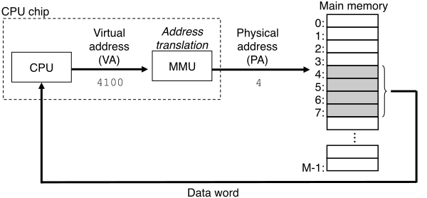

# 2. 地址空间

# 3. 虚拟内存的缓存功能

## 3.1. DRAM 缓存器组织

## 3.2. 页面表


## 3.3. 页面命中

## 3.4. 页面故障

|                           之前                            |                           之后                           |
| :-------------------------------------------------------: | :------------------------------------------------------: |
| 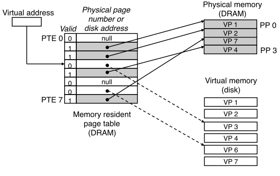 |  |

**页面故障 (page fault)**：假设 `VP[3]` 不在物理内存中，需从硬盘读取。步骤如下：

1. 在物理内存中选择 `VP[4]` 作为**受害者 (victim)**。
2. 若 `VP[4]` 被修改过，则将其写入硬盘。
3. 从硬盘读取 `VP[3]`，写入 `PP[3]`，即替换 `VP[4]`。

## 3.5. 分配页面

## 3.6. 利用局部性

# 4. 虚拟内存的管理功能


# 5. 虚拟内存的保护功能<a href id="protect"></a>

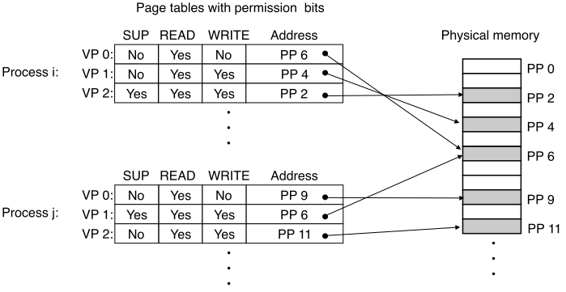

其中 `SUP` 表示以**监管者模式 (SUPervisor mode)** 即**内核模式 (kernel mode)** 运行。

# 6. 地址翻译


## 6.1. 集成缓存器与虚拟内存

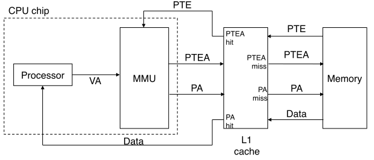

- **MMU (Memory Management Unit)**
- **PTE (Page Table Entry)**
- **PTEA (Page Table Entry Address)**

## 6.2. 用 TLB 加速地址翻译

## 6.3. 多级页面表


## 6.4. 地址翻译实例

# 7. 实例：Intel Core i7 / Linux 内存系统

## 7.1. Core i7 地址翻译

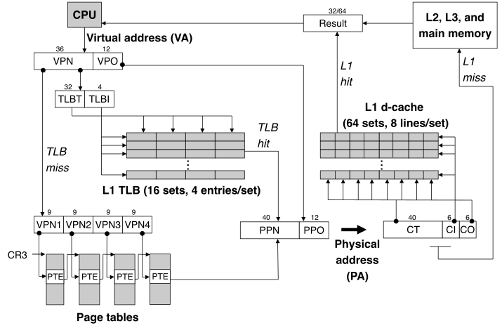

## 7.2. Linux 虚拟内存系统

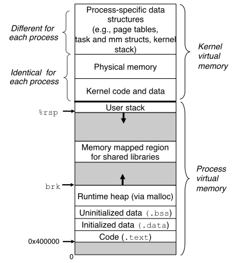 

### Linux 虚拟内存管理

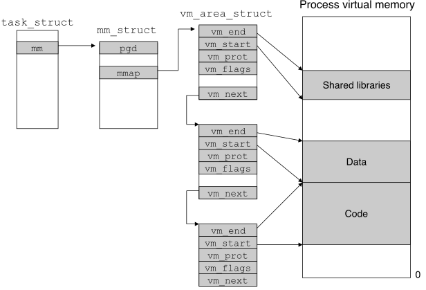

### Linux 页面故障处置

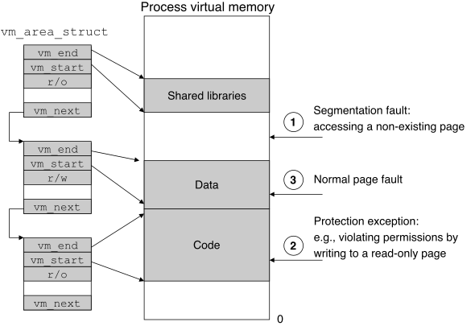

# 8. 内存映射<a href id="memory-map"></a>

## 8.1. 共享对象再探

**写时复制 (Copy-On-Write, COW)**：

|                    两个进程共享数据                     |              进程 2 在私有 COW 页面写入数据              |
| :-----------------------------------------------------: | :------------------------------------------------------: |
|  |  |

## 8.2. `fork()` 再探

## 8.3. `evecve()` 再探

## 8.4. `mmap()`

```c
#include <unistd.h>
#include <sys/mman.h>
void *mmap(void *start/* 建议起始位置，可以是 NULL */, size_t length/* 读取长度 */,
           int prot/* 权限：PROT_EXEC | PROT_READ | PROT_WRITE | PROT_NONE */,
           int flags/* 映射类型：MAP_ANON | MAP_PRIVATE | MAP_SHARED */,
           int fd/* 文件描述符 */, off_t offset/* 文件偏移量 */);
    // Returns: pointer to mapped area if OK, MAP_FAILED (−1) on error
int munmap(void *start, size_t length);
    // Returns: 0 if OK, −1 on error
```

此函数从文件 `fd` 读取始于 `offset` 字节、长度为 `length` 字节的数据区块，映射到（可能）始于 `start` 的虚拟内存空间。

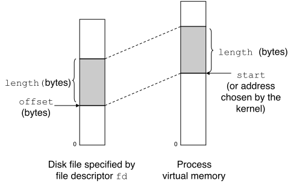

# 9. 动态内存分配


**堆 (heap)**：虚拟内存中紧跟在“未初始化数据”后面的一区块连续区域

- `brk`：指向堆顶（堆内最后一个字节的下一子节）
- **区块 (block)**：堆内一段连续的区域
  - **分配的 (allocated)**：
  - **空闲的 (free)**：

**动态内存分配器 (dynamic memory allocator)**：维护堆内存的软件接口

- **显式分配器 (explicit allocator)**：已分配的动态内存需由应用程序主动释放。本节剩余部分详细介绍显式分配器的实现。
- **隐式分配器 (implicit allocator)**：自动检测并释放不再被使用的动态内存，又名**垃圾回收器 (garbage collector, GC)**。[第 9.10 节](#gc)简要介绍隐式分配器的实现。
- **标准分配器 (standard allocator)**：
- **应用指定分配器 (application-specific allocator)**：

## 9.1. `malloc()` 与 `free()`

C 语言标准库提供了以下动态内存接口：

```c
#include <stdlib.h>
void* malloc(size_t n);  // 不初始化
void* calloc(size_t k, size_t s);  // 初始化为零
void* realloc(void* p, size_t n);  // 改变已分配区块的大小
```

这组函数请求动态内存。若成功，则返回长度至少为 `n` 或 `k*s` 字节、满足对齐要求的可用区块的地址；否则，返回 `NULL`。

```c
#include <stdlib.h>
void free(void* ptr);
```

此函数释放动态内存。其中 `ptr` 必须指向 `malloc()` 等函数返回的地址；否则，其行为未定义。

实现上述接口，需要用到管理堆内存的系统调用：

```c
#include <unistd.h>
void* sbrk(intptr_t incr);
```

它（通过其他系统调用）改变堆的大小。若成功，则返回旧的 `brk`；否则，返回 `(void*)(-1)`，并将 `errno` 置为 `ENOMEM`。

## 9.2. 为何需要动态内存？

主要原因：程序运行前，不知道所需空间大小。

⚠️ 用“足够大”的静态数组，有指标越界的风险。

## 9.3. 分配器的需求与目标

需求：

- 能够处置任意请求序列
- 能够立即响应请求
- 只能使用堆内存
- 区块的地址要对齐
- 不能改动已分配的区块

目标：使以下指标最大化

- **吞吐量 (throughput)**：单位时间内完成的请求数量
- **利用率 (utilization)**：$U_k=(\max_{i\le k}P_i)/H_k$，其中
  - $U_k$ 为前 $k$ 个请求的**峰值利用率 (peak utilitization)**
  - $P_k$ 为前 $k$ 个请求的**总有效载荷 (aggregated payload)**
  - $H_k$ 为第 $k$ 个请求完成后的**堆大小 (heap size)**，假设其单调递增。

## 9.4. 碎片化

- **内部碎片化 (internal fragmentation)**：区块内除有效载荷外，还有不能被正常使用的占位字节。
- **外部碎片化 (external fragmentation)**：堆内有足够多的空闲字节，但没有一个空闲区块足够大。

## 9.5. 实现策略

- **空闲区块组织 (free block organization)**：
  - 隐式链表
  - 显式链表
  - 分离链表
- **放置 (place)**：
  - 首个匹配
  - 下个匹配
  - 最佳匹配
- **分裂 (split)**：
  - 置于原处
  - 置于表头
- **合并 (coalesce)**：
  - 立即合并
  - 延迟合并

## 9.6. 隐式的空闲区块链表


### 9.7. 查找足够大的区块

```c
static void *find_fit(size_t alloc_size) {
    char *block = first_block;
    size_t block_size; /* Size of current block */

    do { /* First-hit */
        block = NEXT(block);
        block_size = GET_SIZE(HEADER(block));
        if (block_size == 0) {
            block = NULL;
            break;
        }
    } while (block_size < alloc_size || GET_ALLOC(HEADER(block)));

    return block;
}
```

### 9.8. 分裂过大的空闲区块

```c
static void place(void *block, size_t alloc_size) {
    size_t block_size = GET_SIZE(HEADER(block));
    int split = (block_size > alloc_size + QSIZE);

    if (split) {
        /* The remaining of current block can hold a min-sized block. */
        PUT(HEADER(block), PACK(alloc_size, 1));
        PUT(FOOTER(block), PACK(alloc_size, 1));
        block = NEXT(block);
        block_size -= alloc_size;
    }
    PUT(HEADER(block), PACK(block_size, !split));
    PUT(FOOTER(block), PACK(block_size, !split));
}
```

### 9.9. 获取更多的动态内存

```c
static void *extend_heap(size_t words) {
    char *block;
    size_t size;

    /* Allocate an even number of words to maintain alignment */
    size = ((words % 2) + words) * WSIZE;
    if ((block = mem_sbrk(size)) == (void *)-1)  
        return NULL;

    /* Initialize free block header/footer and the epilogue header */
    PUT(HEADER(block), PACK(size, 0));         /* Free block header */
    PUT(FOOTER(block), PACK(size, 0));         /* Free block footer */
    PUT(HEADER(NEXT(block)), PACK(0, 1));    /* New epilogue header */

    /* Coalesce if the previous block was free */
    return coalesce(block);
}
```

### 9.10. 合并相邻的空闲区块

|                         Case 1                         |                         Case 2                         |
| :----------------------------------------------------: | :----------------------------------------------------: |
|  |  |

|                         Case 3                         |                         Case 4                         |
| :----------------------------------------------------: | :----------------------------------------------------: |
|  | 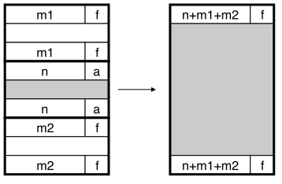 |

### 9.11. 利用边界标签合并

```c
static void *coalesce(void *block) {
    size_t prev_alloc = GET_ALLOC(FOOTER(PREV(block)));
    size_t next_alloc = GET_ALLOC(HEADER(NEXT(block)));
    size_t size = GET_SIZE(HEADER(block));

    if (prev_alloc && next_alloc) {            /* Case 1 */
    }
    else if (prev_alloc && !next_alloc) {      /* Case 2 */
        size += GET_SIZE(HEADER(NEXT(block)));
        PUT(HEADER(block), PACK(size, 0));
        PUT(FOOTER(block), PACK(size,0));
    }
    else if (!prev_alloc && next_alloc) {      /* Case 3 */
        size += GET_SIZE(HEADER(PREV(block)));
        PUT(FOOTER(block), PACK(size, 0));
        PUT(HEADER(PREV(block)), PACK(size, 0));
        block = PREV(block);
    }
    else {                                     /* Case 4 */
        size += GET_SIZE(HEADER(PREV(block)))
              + GET_SIZE(FOOTER(NEXT(block)));
        PUT(HEADER(PREV(block)), PACK(size, 0));
        PUT(FOOTER(NEXT(block)), PACK(size, 0));
        block = PREV(block);
    }

    return block;
}
```

### 9.12. 简易分配器的实现

#### 设计概要

`memlib.c` 实现了一个简易的虚拟内存系统：

```c
#define MAX_HEAP (20*(1<<20))  /* 20 MB */

static char *mem_head;     /* 堆首字节的地址 */
static char *mem_tail;     /* 堆尾字节的地址 + 1 */
static char *mem_max_addr; /* 最大合法堆地址 + 1 */

void mem_init(void) {
    mem_head = (char *)Malloc(MAX_HEAP);
    mem_tail = (char *)mem_head;
    mem_max_addr = (char *)(mem_head + MAX_HEAP);
}

void *mem_sbrk(int incr) {
    char *old_brk = mem_tail;
    if ((incr < 0) || ((mem_tail + incr) > mem_max_addr)) {
        errno = ENOMEM;
        fprintf(stderr, "ERROR: mem_sbrk failed. Ran out of memory...\n");
        return (void *)-1;
    }
    mem_tail += incr;
    return (void *)old_brk;
}
```

`mm.c` 实现了一个基于“隐式链表”的分配器：

```c
extern int mm_init(void);
extern void *mm_malloc(size_t size);
extern void mm_free(void *ptr);
```

为简化*合并相邻的空闲区块*，在链表两端引入一对辅助区块：
- **起始区块 (prologue block)**：长度为 8 B，只含*区块首部*及*区块尾部*。
- **结尾区块 (epilogue block)**：长度为 4 B，只含*区块首部*，并标记为*已分配的*。


#### 尺寸常量、区块操作

```c
#define WSIZE       4   /* word size (bytes) */
#define DSIZE       8   /* double word size (bytes) */
#define CHUNK  (1<<12)  /* extend heap by this amount (bytes) */

#define MAX(x, y) ((x) > (y) ? (x) : (y))

/* PACK a size and allocated bit into a word */
#define PACK(size, alloc)  ((size) | (alloc))

/* GET and PUT a word at address p */
#define GET(p)       (*(unsigned int *)(p))
#define PUT(p, val)  (*(unsigned int *)(p) = (val))

/* GET the SIZE and ALLOCated fields from address p */
#define GET_SIZE(p)   (GET(p) & ~0x7)
#define GET_ALLOC(p)  (GET(p) &  0x1)

/* Given block ptr block, compute address of its HEADER and FOOTER */
#define HEADER(block)  ((char *)(block) - WSIZE)
#define FOOTER(block)  ((char *)(block) + GET_SIZE(HEADER(block)) - DSIZE)

/* Given block ptr block, compute address of NEXT and PREVious blocks */
#define NEXT(block)  ((char *)(block) + GET_SIZE(((char *)(block) - WSIZE)))
#define PREV(block)  ((char *)(block) - GET_SIZE(((char *)(block) - DSIZE)))

/* e.g. get the size of the next block */
size_t size = GET_SIZE(HEADER(NEXT(block)));
```

#### 链表初始化

```c
/* Global variables */
static char *first_block = NULL; /* Pointer to first block */

int mm_init(void) {
    /* Create the initial empty heap */
    if ((first_block = mem_sbrk(4*WSIZE)) == (void *)-1)
        return -1;
    PUT(first_block, 0);                          /* Padding on head */
    PUT(first_block + (1*WSIZE), PACK(DSIZE, 1)); /* Prologue header */ 
    PUT(first_block + (2*WSIZE), PACK(DSIZE, 1)); /* Prologue footer */ 
    PUT(first_block + (3*WSIZE), PACK(0, 1));     /* Epilogue header */
    first_block += (2*WSIZE);

    /* Extend the empty heap with a free block of CHUNK bytes */
    if (extend_heap(CHUNK / WSIZE) == NULL) 
        return -1;
    return 0;
}
```

#### 区块的释放

```c
void mm_free(void *block) {
    if (block == NULL) 
        return;

    size_t size = GET_SIZE(HEADER(block));
    if (first_block == NULL)
        mm_init();

    PUT(HEADER(block), PACK(size, 0));
    PUT(FOOTER(block), PACK(size, 0));
    coalesce(block);
}
```

#### 区块的分配

```c
void *mm_malloc(size_t size) {
    size_t alloc_size; /* Adjusted block size */
    size_t chunk_size; /* Amount to extend heap if no fit */
    char *block;

    if (first_block == NULL)
        mm_init();

    /* Ignore spurious requests */
    if (size == 0)
        return NULL;

    /* Adjust block size to include overhead and alignment reqs. */
    if (size <= DSIZE)
        alloc_size = DSIZE + DSIZE; /* payload + overhead */
    else
        alloc_size = DSIZE * (((size + DSIZE) + (DSIZE-1)) / DSIZE);

    /* Search the free list for a fit */
    if ((block = find_fit(alloc_size)) == NULL) {
        /* No fit found. Get more memory. */
        chunk_size = MAX(alloc_size, CHUNK);
        if ((block = extend_heap(chunk_size/WSIZE)) == NULL)  
            return NULL;
    }
    place(block, alloc_size);
    return block;
}
```

## 9.13. 显式的空闲区块链表

空闲区块的*有效载荷*部分可用于存储指针，以便构造出*链表*等数据结构。

新空闲区块安置策略

- **后进先出 (LIFO)**：刚被释放的区块总是被置于链表头部。
- **地址顺序 (address order)**：链表中的（自由）区块总是按地址升序排列。

[Malloc Lab](./labs/malloc/README.md) 中的 [`mm_explicit.c`](./labs/malloc/mm_explicit.c) 给出了一种实现基于 LIFO 的实现。

## 9.14. 分离的空闲区块链表

**分离链表 (segregated lists)**：

- **尺寸类 (size class)**：由具有（大致）相同尺寸的空闲区块组成的集合。常用的划分有
  - $(0,1],(1,2],(2,4],\dots,(512,1024],(1024,2048],(2048,4096],(4096,\infty)$
  - $(0,1],\dots,(1022,1023],(1023,1024],(1024,2048],(2048,4096],(4096,\infty)$
- 将每个尺寸类中的空闲区块，组织为一条显式链表。

### 简易分离存储

**简易分离存储 (simple segregated storage)**：每条链表中的空闲区块具有相同的尺寸；不分裂或合并空闲区块。

- 【优点】分配、释放均可在常数时间内完成（调用 `sbrk()` 除外）；无需区块首部、区块尾部；用单向链表即可实现。
- 【缺点】空间利用率低。

### 分离匹配

**分离匹配 (segregated fits)**：GCC 的实现方案。

- 【分配】
  - 根据所需区块的尺寸，确定最匹配的链表，在其中查找首个可用的空闲区块；若找不到，则进入空闲区块尺寸更大的链表查找。
  - 若所有链表均无可用空闲区块，则向操作系统请求更多堆内存。
  - 分割找到的空闲区块，将剩余部分插入合适的链表。
- 【释放】
  - 若可能，合并相邻空闲区块（四种情形）。
  - 将所得（可能更大的）空闲区块插入合适的链表。

# 10. 垃圾回收<a href id="gc"></a>

## 10.1. 垃圾回收器基础


## 10.2. 标记-清扫

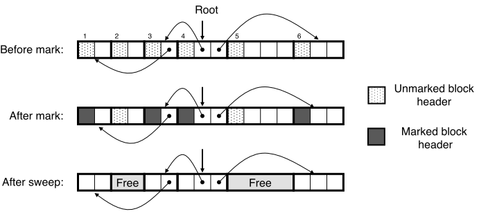

# 11. 与内存相关的 Bugs

## 11.1. 解引用无效指针

## 11.2. 读取未初始化的内存

## 11.3. 允许缓冲区溢出

例如《[3.10.3. 越界访问与缓冲区溢出](./3_machine_level_programming.md#buffer-overflow)》

## 11.4. 依赖指针大小

```c
/* Create an nxm array */
int **makeArray1(int n, int m) {
  int i;
  int **A = (int **)Malloc(n * sizeof(int/* 应为 `int*` */));
  for (i = 0; i < n; i++)
    A[i] = (int *)Malloc(m * sizeof(int));
  return A;
}
```

## 11.5. 数组越界

## 11.6. 优先级错误

```c
*(p++);
(*p)++;
```

## 11.7. 指针算数错误

## 11.8. 返回局部变量的地址

## 11.9. 访问已释放的动态对象

## 11.10. 内存泄漏（未及时释放）

## [内存检查工具](../cpp/memory/check.md)

