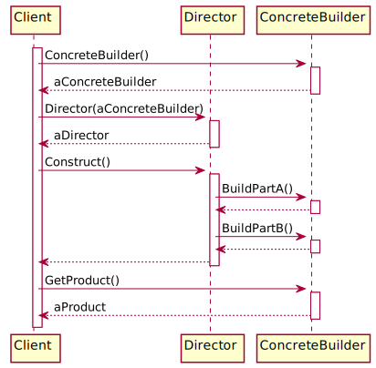

# Builder

## 意图
Separate the construction of a complex object from its representation so that the same construction process can create different representations.

分离复杂对象的构造与表示，使得同一构造过程适用于不同表示。

## 用途
- 让复杂对象的构造算法独立于部件的构造和组装。
- 让同一构造过程适用于不同表示。

## 类图

## 参与者
- **抽象构造者** (`Builder`)
  - 为每个*部件*声明一个创建方法，可以是留待*具体构造者*实现的抽象方法 (`BuildPartA()`)，也可以是实现了的具体方法 (`BuildPartB()`)。
- **具体构造者** (`ConcreteBuilder`)
  - 实现*抽象构造者*，创建各*部件*并进行组装。
  - 定义和维护*产品*的内部表示（数据结构）。
  - 提供获取最终*产品*的方法 (`GetProduct()`)。
- **指挥者** (`Director`)
  - 利用*抽象构造者*的接口构造*产品*。
- **产品** (`Product`)
  - 声明需要构造的复杂对象的接口。

## 时序图

