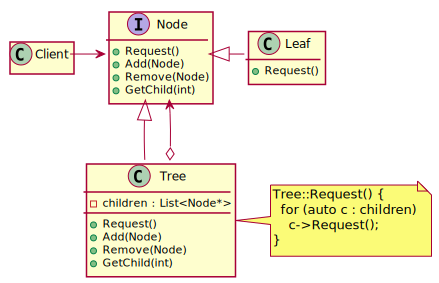

# Composite

## 定义
Compose objects into tree structures to represent part-whole hierarchies.
Composite lets clients treat individual objects and compositions of objects uniformly.

将对象组合为树状结构，以便用户以统一的方式使用单个对象和对象组合。

## 用途
- 表示由对象构成的部分/整体层次结构。
- 允许用户忽略单个对象与对象组合之间的区别。

## 类图

## 参与者
- **结点** (`Node`)
  - 声明*叶结点*和*树结点*的公共接口 (`Request()`)。
  - 声明访问、管理子结点的接口 (`Add()`, `Remove()`, `GetChild()`)。
  - （可选）声明访问父结点的接口。
  - 提供部分接口的默认实现。
- **叶结点** (`Leaf`)
  - 表示不含子结点的末端结点。
  - 定义初等对象的行为。
- **树结点** (`Tree`)
  - 定义含有子结点的*复合结点*的行为。
  - 存储子结点。
  - 实现访问、管理子结点的接口 (`Add()`, `Remove()`, `GetChild()`)。
- **用户** (`Client`)
  - 通过*结点*的接口操作对象，而不去区分*叶*和*树*。
